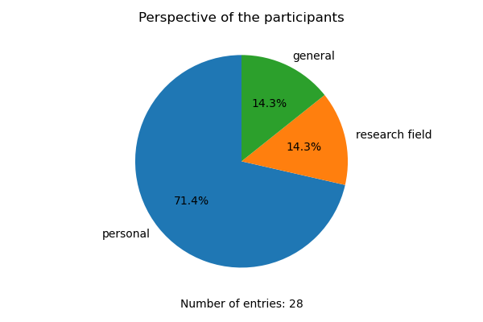
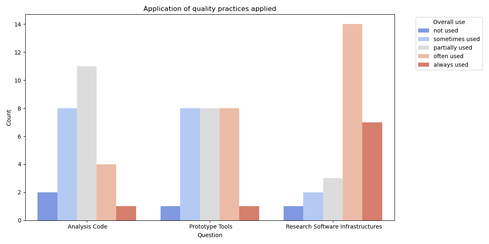
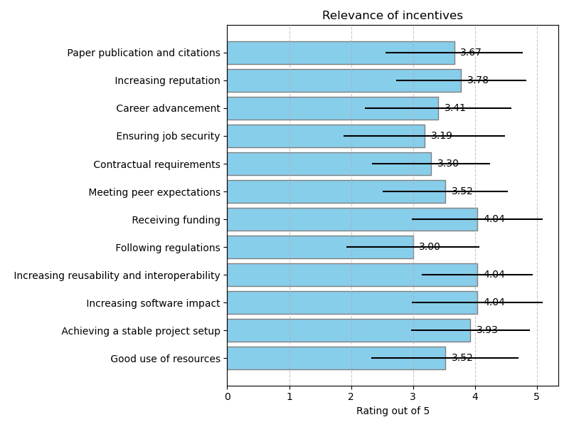
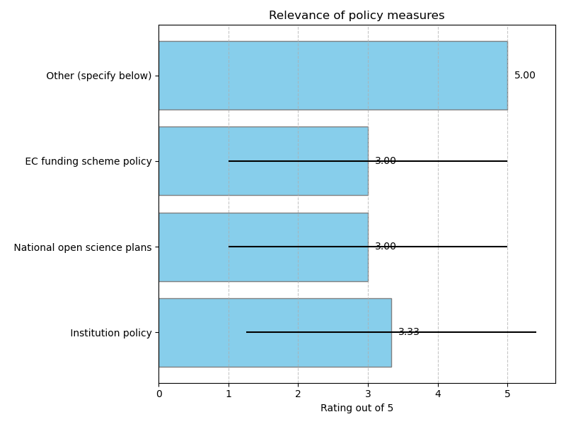
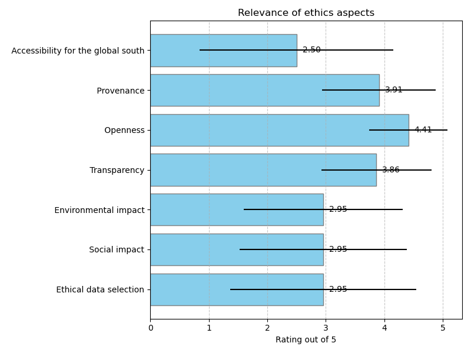
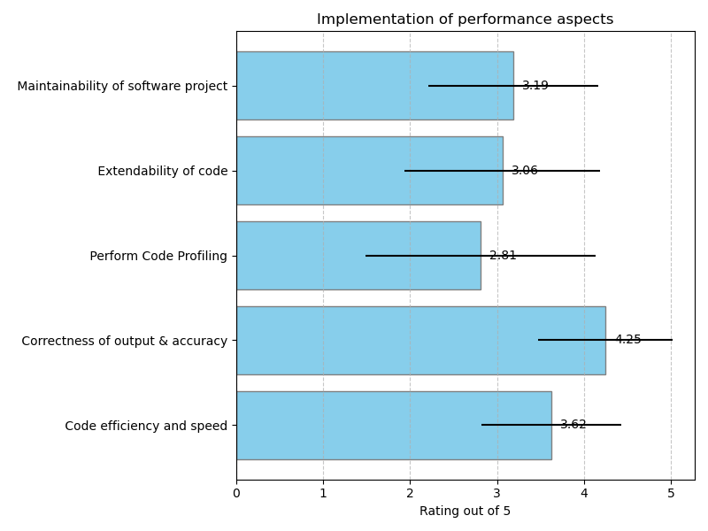
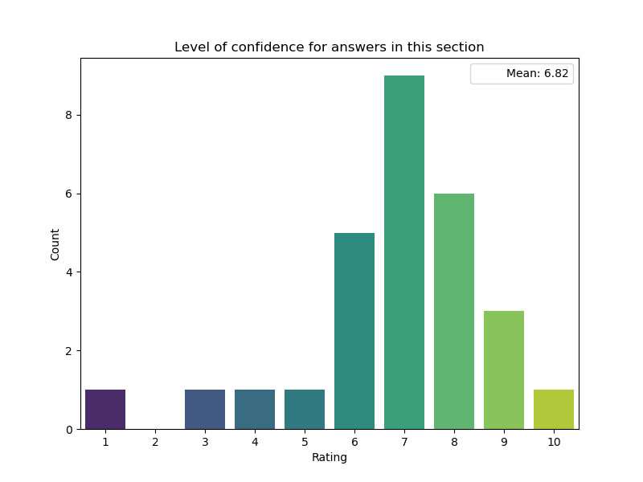

# EVERSE software quality landscaping survey

## Survey results

## Participation

Statistics on the survey responses

### Perspective of the participants

### Research field

|    | Your research field                                                                                      |
|---:|:---------------------------------------------------------------------------------------------------------|
|  0 | Library and Information Science                                                                          |
|  1 | Language technology, digital humanities                                                                  |
|  5 | Computer science/Distributed systems                                                                     |
|  6 | Software engineering in high energy physics                                                              |
|  8 | neutrino astrophysics                                                                                    |
|  9 | eScience                                                                                                 |
| 10 | High-energy Physics (Astroparticle, Particle and Hadron Physics), Astronomy                              |
| 12 | Artificial Intelligence                                                                                  |
| 13 | Computer Science (with a focus on services for life sciences)                                            |
| 14 | Bioinformatics and data science                                                                          |
| 15 | Astronomy                                                                                                |
| 16 | The course name is Brain Mind computer Science, and my research field is life science and bioinformatics |
| 18 | Bioinformatics - Biomedical Sciences                                                                     |
| 19 | NLP, Computational Linguistics, SSH                                                                      |
| 20 | Bioinformatics                                                                                           |
| 22 | Computing for high energy physics                                                                        |
| 23 | Bioinformatics                                                                                           |
| 24 | Atmospheric science                                                                                      |
| 26 | Bioinformatics                                                                                           |
| 27 | Basic research in matter and materials, laser technology, photon science, fluid dynamics,                |

### Involvement of the participant with research software

Multiple selections were possible

### Participation in EOSC science clusters

## Participation
## Software levels

Guidelines specific to different software levels

### Alternative approaches to software levels

|    | URL to definition                                                                                   | Description                                                                                                                                                                                                                                                                                                                                                          |
|---:|:----------------------------------------------------------------------------------------------------|:---------------------------------------------------------------------------------------------------------------------------------------------------------------------------------------------------------------------------------------------------------------------------------------------------------------------------------------------------------------------|
|  0 | https://oceanrep.geomar.de/id/eprint/59801/1/2024-01-16ResearchSoftwareCategories.pdf               | see also                                                                                                                                                                                                                                                                                                                                                             |
|    |                                                                                                     | https://elib.dlr.de/200635/                                                                                                                                                                                                                                                                                                                                          |
|    |                                                                                                     |  Druskat, Stephan (2023) Application Classes in the DLR Software Engineering Guidelines. AK-KFS: 1. Treffen Arbeitskreis Kategorien von Forschungssoftware der FG Research Software Engineering in der GI, 2023-11-20 - 2023-11-21, Braunschweig, Germany.                                                                                                           |
|  1 |                                                                                                     | These levels are not formalised in our community, but all of them exist. On the other hand, they also overlap, for instance we have RSI that actually comprises analysis sw, for language analysis like natural language parsing services, or machine translation services.                                                                                          |
|  6 | https://arxiv.org/pdf/1712.06982                                                                    |                                                                                                                                                                                                                                                                                                                                                                      |
|  7 |                                                                                                     | OpenAIRE does not typically use the specific terms "Analysis Code," "Prototype Tools," and "Research Software Infrastructure" as formal categories in its documentation or community guidelines. However, OpenAIRE does focus on various aspects of research software, including tools, platforms, and infrastructure that support open science and data management. |
|  9 |                                                                                                     | We know the software levels but have not (yet) formally integrated them in common practices, except in our external communication about software management plans.                                                                                                                                                                                                   |
| 10 | https://doi.org/10.5281/zenodo.1344612                                                              | The DLR Software Engineering Guidelines are just an example.                                                                                                                                                                                                                                                                                                         |
|    |                                                                                                     | The community is divers in its definition of software and the software quality maturity. Usually definitions are provided within the large research infrastructures (such as ESFRIs, international collaborations and consortia).                                                                                                                                    |
| 11 | https://doi.org/10.14278/rodare.2748                                                                | We are following the DLR software classes, which have one more level, but in general follow the same approach                                                                                                                                                                                                                                                        |
| 12 |                                                                                                     | The definitions handles at the moment are the same ones as provided above, but many people in my group are still unaware of them                                                                                                                                                                                                                                     |
| 15 |                                                                                                     | I feel like these levels exist but without any clear definition. People tend to make a difference between codes, especially if the code is developed/supported directly by a research infrastructure.                                                                                                                                                                |
| 18 | - https://www.embl-hamburg.de/biosaxs/manuals/eom.html                                              |                                                                                                                                                                                                                                                                                                                                                                      |
|    | - https://www.mdtraj.org/1.9.8.dev0/index.html                                                      |                                                                                                                                                                                                                                                                                                                                                                      |
|    | - http://www.shiftx2.ca/                                                                            |                                                                                                                                                                                                                                                                                                                                                                      |
|    | - https://biopython.org/wiki/Documentation                                                          |                                                                                                                                                                                                                                                                                                                                                                      |
|    | - https://www.ibs.fr/fr/communication/production-scientifique/logiciels/flexible-meccano-en?lang=fr |                                                                                                                                                                                                                                                                                                                                                                      |
|    | - https://github.com/KULL-Centre/CALVADOS                                                           |                                                                                                                                                                                                                                                                                                                                                                      |
| 19 |                                                                                                     | I'm not aware of any explicit categorization, but the notion that all code is not the same (some is tested more, some is documented better, some is modular, some is spaghetti etc.) and that the purpose changes (and with that some attributes of the code might change as well), is definitely there.                                                             |
| 27 | https://rodare.hzdr.de/record/2748                                                                  | See reference above.                                                                                                                                                                                                                                                                                                                                                 |

### Importance of the software level

### Application of quality practices applied

### Guidelines analysis code

|    | Scope                                                                           | type of guideline                                                                                                  | Description                                                                                                                                                                                                                                                                                                                                                                                                                                                                                                                                                                                                                                                                                                           |
|---:|:--------------------------------------------------------------------------------|:-------------------------------------------------------------------------------------------------------------------|:----------------------------------------------------------------------------------------------------------------------------------------------------------------------------------------------------------------------------------------------------------------------------------------------------------------------------------------------------------------------------------------------------------------------------------------------------------------------------------------------------------------------------------------------------------------------------------------------------------------------------------------------------------------------------------------------------------------------|
|  1 | General guidelines                                                              | sw engineering principles, FAIR guidelines                                                                         | 1) In language technology, the researchers are all sw engineers, so the general guidelines are not published, but assumed as a matter of course                                                                                                                                                                                                                                                                                                                                                                                                                                                                                                                                                                       |
|    |                                                                                 |                                                                                                                    | 2) specifically in Language tech. / NLP open source and FAIR approach is extremely strong historically, so publishing both sw and data is practically required as part of submissions of research papers.                                                                                                                                                                                                                                                                                                                                                                                                                                                                                                             |
|  2 | General guidelines                                                              |                                                                                                                    |                                                                                                                                                                                                                                                                                                                                                                                                                                                                                                                                                                                                                                                                                                                       |
|  3 | General guidelines                                                              |                                                                                                                    |                                                                                                                                                                                                                                                                                                                                                                                                                                                                                                                                                                                                                                                                                                                       |
|  8 | General guidelines; Research-specific guidelines                                | Checklist for repository setup                                                                                     | Internal KM3NeT checklist for the setup of an analysis repository, based on various checklists available online like https://medium.com/semantixbr/checklist-to-set-up-a-data-science-project-repository-b3ce1ea3bbe7                                                                                                                                                                                                                                                                                                                                                                                                                                                                                                 |
|  9 | General guidelines; Research-specific guidelines                                | coding, reproducibility, citation, etc.                                                                            | https://book.the-turing-way.org                                                                                                                                                                                                                                                                                                                                                                                                                                                                                                                                                                                                                                                                                       |
| 10 | General guidelines                                                              | https://docs.github.com/en/repositories/creating-and-managing-repositories/best-practices-for-repositories         | Again the community is diverse and especially on the analysis code level, just general guidelines are provided from within the experiments and their user communities. As example the GitHub best practices are linked above.                                                                                                                                                                                                                                                                                                                                                                                                                                                                                         |
|    |                                                                                 |                                                                                                                    | There are training events however, e.g. the ESCAPE Summer schools, see https://escape2020.github.io/                                                                                                                                                                                                                                                                                                                                                                                                                                                                                                                                                                                                                  |
| 11 | General guidelines                                                              | HZDR Software Policy                                                                                               | https://doi.org/10.14278/rodare.2748                                                                                                                                                                                                                                                                                                                                                                                                                                                                                                                                                                                                                                                                                  |
| 12 | General guidelines; Research-specific guidelines                                | (not sure which types to select from). General guidelines                                                          | While recent, I have been sharing https://zenodo.org/records/10047401 for FAIRness.                                                                                                                                                                                                                                                                                                                                                                                                                                                                                                                                                                                                                                   |
|    |                                                                                 |                                                                                                                    | https://citation-file-format.github.io/ for building CFF files, together with https://guides.github.com/activities/citable-code/                                                                                                                                                                                                                                                                                                                                                                                                                                                                                                                                                                                      |
|    |                                                                                 |                                                                                                                    | https://codemeta.github.io/codemeta-generator/ for guiding codemeta creation                                                                                                                                                                                                                                                                                                                                                                                                                                                                                                                                                                                                                                          |
|    |                                                                                 |                                                                                                                    | https://inbo.github.io/tutorials/tutorials/git_zenodo/ to show how to create GitHub-Zenodo bridges for releases                                                                                                                                                                                                                                                                                                                                                                                                                                                                                                                                                                                                       |
|    |                                                                                 |                                                                                                                    | https://semver.org/ to show how semantic versioning works in releases                                                                                                                                                                                                                                                                                                                                                                                                                                                                                                                                                                                                                                                 |
|    |                                                                                 |                                                                                                                    | http://www.creativecommons.org/licenses and https://spdx.org/licenses/ to explain which license to use in code                                                                                                                                                                                                                                                                                                                                                                                                                                                                                                                                                                                                        |
|    |                                                                                 |                                                                                                                    | I also point to https://scientificpaperofthefuture.org/materials.html for general training                                                                                                                                                                                                                                                                                                                                                                                                                                                                                                                                                                                                                            |
|    |                                                                                 |                                                                                                                    | -Domain specific- We also have validators like https://oops.linkeddata.es/ and https://w3id.org/foops/ for ontologies, which review best practices and provide suggestions.                                                                                                                                                                                                                                                                                                                                                                                                                                                                                                                                           |
| 14 | General guidelines                                                              | General guidelines                                                                                                 | - Code readability                                                                                                                                                                                                                                                                                                                                                                                                                                                                                                                                                                                                                                                                                                    |
|    |                                                                                 |                                                                                                                    | - Documentation                                                                                                                                                                                                                                                                                                                                                                                                                                                                                                                                                                                                                                                                                                       |
|    |                                                                                 |                                                                                                                    | - Ensuring re-usability                                                                                                                                                                                                                                                                                                                                                                                                                                                                                                                                                                                                                                                                                               |
| 15 | General guidelines                                                              | good code practices, making the code runnable for myself others                                                    |                                                                                                                                                                                                                                                                                                                                                                                                                                                                                                                                                                                                                                                                                                                       |
| 16 | General guidelines                                                              |                                                                                                                    |                                                                                                                                                                                                                                                                                                                                                                                                                                                                                                                                                                                                                                                                                                                       |
| 18 | Community-specific guidelines                                                   | MIADE                                                                                                              | - https://pubmed.ncbi.nlm.nih.gov/37400558/                                                                                                                                                                                                                                                                                                                                                                                                                                                                                                                                                                                                                                                                           |
| 19 | General guidelines; Research-specific guidelines; Community-specific guidelines |                                                                                                                    | I can't think of anything to point to directly. I guess you sort of absorb a set of guidelines/practices as you go. Be it from some intro courses, the team you've joined, the environment you need to interface with...                                                                                                                                                                                                                                                                                                                                                                                                                                                                                              |
|    |                                                                                 |                                                                                                                    |                                                                                                                                                                                                                                                                                                                                                                                                                                                                                                                                                                                                                                                                                                                       |
|    |                                                                                 |                                                                                                                    | I guess one research specific guideline, especially where you research is of computational nature is to have some sort of experiment management system. You generally want to run multiple experiments in parallel and be somehow able to map the results to the changes between individual runs. This can vary in complexity from reasonable conventions to elaborate tools.                                                                                                                                                                                                                                                                                                                                         |
|    |                                                                                 |                                                                                                                    |                                                                                                                                                                                                                                                                                                                                                                                                                                                                                                                                                                                                                                                                                                                       |
|    |                                                                                 |                                                                                                                    | I don't know if 'use relevant standards' (e.g. for data input/output/interchange) is a general or community specific guideline. Views on what's relevant might vary inside a community.                                                                                                                                                                                                                                                                                                                                                                                                                                                                                                                               |
| 20 | General guidelines; Research-specific guidelines                                | Guidelines for the development and publication of a pipeline as Python package for high throughput data analysis . | In general, software analysis, involves the use of Jupyter notebooks (https://jupyter.org/) for quick start of data analysis with Python. This is an easy way where the developer can explore the data, manipulate it in many ways and clean it if necessary. Data visualisation is also often involved, with the use of many already available packages such as matplotlib, plotly, and many others.                                                                                                                                                                                                                                                                                                                 |
|    |                                                                                 |                                                                                                                    | Then usually the notebook is transformed into a python package, creating a pipeline for data analysis. This package can then published in BioConda (https://bioconda.github.io/) where then other researches can access it and use it.                                                                                                                                                                                                                                                                                                                                                                                                                                                                                |
|    |                                                                                 |                                                                                                                    | If the pipeline is meant for high throughput analysis, then it can be installed in a Python environment of a remote HPC cluster, where the whole data to be analysed resides.                                                                                                                                                                                                                                                                                                                                                                                                                                                                                                                                         |
| 21 | General guidelines                                                              |                                                                                                                    |                                                                                                                                                                                                                                                                                                                                                                                                                                                                                                                                                                                                                                                                                                                       |
| 23 | General guidelines                                                              | reproducibility, documentation, and proper citation of tools, coding standards like PEP8, FAIR principles          | I follow a combination of general software development guidelines, such as coding standards (like PEP 8 for Python), version control practices with Git, and thorough testing and documentation. For research-specific needs, I prioritize reproducibility by using tools like Jupyter Notebooks, managing data carefully, and employing containerization. I also adhere to community-specific guidelines, such as best practices in data science for model tracking and bioinformatics standards for reproducibility. Additionally, I incorporate principles from the Research Software Engineering community and the FAIR guidelines to ensure that my research code is sustainable, collaborative, and accessible. |
| 24 | Other                                                                           |                                                                                                                    | No guidelines, more learnt from others practises (informally).                                                                                                                                                                                                                                                                                                                                                                                                                                                                                                                                                                                                                                                        |
| 25 | General guidelines                                                              | coding guidelines                                                                                                  | - document code                                                                                                                                                                                                                                                                                                                                                                                                                                                                                                                                                                                                                                                                                                       |
|    |                                                                                 |                                                                                                                    | - use sensible variable names                                                                                                                                                                                                                                                                                                                                                                                                                                                                                                                                                                                                                                                                                         |
|    |                                                                                 |                                                                                                                    | - modular structure                                                                                                                                                                                                                                                                                                                                                                                                                                                                                                                                                                                                                                                                                                   |
|    |                                                                                 |                                                                                                                    | - etc                                                                                                                                                                                                                                                                                                                                                                                                                                                                                                                                                                                                                                                                                                                 |
| 26 | General guidelines; Research-specific guidelines                                |                                                                                                                    |                                                                                                                                                                                                                                                                                                                                                                                                                                                                                                                                                                                                                                                                                                                       |
| 27 | Research-specific guidelines                                                    | Institutional Software Policy                                                                                      | https://rodare.hzdr.de/record/2748                                                                                                                                                                                                                                                                                                                                                                                                                                                                                                                                                                                                                                                                                    |

|    | Are you aware of any guidelines or mechanisms that help to improve analysis code towards the prototype tool level? If yes, describe and/or provide links.                                                                                                   |
|---:|:------------------------------------------------------------------------------------------------------------------------------------------------------------------------------------------------------------------------------------------------------------|
|  1 | no                                                                                                                                                                                                                                                          |
|  8 | no                                                                                                                                                                                                                                                          |
|  9 | Practical guide to Software Management Plans: https://zenodo.org/records/7589725                                                                                                                                                                            |
| 10 | No clear guidelines, but examples are given e.g. at the community event "Workshop on Open-Source Software Lifecycles" https://indico.in2p3.fr/event/21698.                                                                                                  |
| 11 | Training via HIFIS                                                                                                                                                                                                                                          |
| 12 | Materials like https://www.freecodecamp.org/news/how-to-create-and-upload-your-first-python-package-to-pypi/ show how to create packages and uploading them to package managers. I have been using them to help make tools in our lab into prototype tools. |
| 15 | - introducing unit tests                                                                                                                                                                                                                                    |
| 20 | The conversion from the notebook to a package surely helps in the creation of a prototype.                                                                                                                                                                  |
| 24 | No.   We run with different compiler settings for error checking (Fortran).                                                                                                                                                                                 |
| 27 | that are many...                                                                                                                                                                                                                                            |

### Guidelines for prototype software

|    | Scope                                             | type of guideline                                         | Description                                                                                                                                                                                      |
|---:|:--------------------------------------------------|:----------------------------------------------------------|:-------------------------------------------------------------------------------------------------------------------------------------------------------------------------------------------------|
|  2 | General guidelines; Community-specific guidelines |                                                           |                                                                                                                                                                                                  |
|  4 | General guidelines                                |                                                           |                                                                                                                                                                                                  |
|  8 | General guidelines                                | general software packages best practices                  | Collection of guidelines from the WOSSL workshop: https://gitlab.in2p3.fr/escape2020/wp3/wossl/-/wikis/Best-Practices-for-software-development                                                   |
|  9 | General guidelines; Community-specific guidelines | coding, software engineering                              | https://guide.esciencecenter.nl                                                                                                                                                                  |
| 10 | Research-specific guidelines                      | https://gammapy.org/contribute.html                       | The prototype tools are typically handled within the experiments, but some are actually open-community driven. An example for that - the community software gammapy - is given in the URL above. |
| 11 | General guidelines; Community-specific guidelines | HZDR Software Policies, Project agreements                | https://doi.org/10.14278/rodare.2748                                                                                                                                                             |
| 12 | General guidelines; Research-specific guidelines  | (not sure which types to select from). General guidelines | Same as above                                                                                                                                                                                    |
| 15 | General guidelines                                | Packaging the software to make it easy to use             |                                                                                                                                                                                                  |
| 19 |                                                   |                                                           | I guess most of the 'Analysis answer' applies as well. One addition would be to document better.                                                                                                 |

|    | Are you aware of any guidelines or mechanisms that help to improve prototype tools towards the software research infrastructure level? If yes, describe and/or provide links.   |
|---:|:--------------------------------------------------------------------------------------------------------------------------------------------------------------------------------|
|  4 | No                                                                                                                                                                              |
|  9 | Practical guide to Software Management Plans: https://zenodo.org/records/7589725                                                                                                |
| 10 | This is an important step that usually also includes certification of the software, however there are no clear mechanisms for the level change.                                 |
| 11 | Training via HIFIS, mentoring from project partners                                                                                                                             |

### Guidelines for research software infrastructure

|    | Scope                                                                                  | type of guideline                                                                                                                                                                 | Description                                                                                                                                                                                                                                                                                                                                                                                                                                                                                                                                                                                                                                                                                                                                                                                                                                                    |
|---:|:---------------------------------------------------------------------------------------|:----------------------------------------------------------------------------------------------------------------------------------------------------------------------------------|:---------------------------------------------------------------------------------------------------------------------------------------------------------------------------------------------------------------------------------------------------------------------------------------------------------------------------------------------------------------------------------------------------------------------------------------------------------------------------------------------------------------------------------------------------------------------------------------------------------------------------------------------------------------------------------------------------------------------------------------------------------------------------------------------------------------------------------------------------------------|
|  0 | Community-specific guidelines                                                          | https://rse.dlr.de/guidelines/00_dlr-se-guidelines_de.html                                                                                                                        |                                                                                                                                                                                                                                                                                                                                                                                                                                                                                                                                                                                                                                                                                                                                                                                                                                                                |
|  1 | Community-specific guidelines                                                          | CLARIN B-centre requirements, LINDAT project requirements for web services                                                                                                        | CLARIN ERIC has requirements for data repositories to be certified. That includes a set of conformance tests. http://hdl.handle.net/11372/DOC-78                                                                                                                                                                                                                                                                                                                                                                                                                                                                                                                                                                                                                                                                                                               |
|    |                                                                                        |                                                                                                                                                                                   |                                                                                                                                                                                                                                                                                                                                                                                                                                                                                                                                                                                                                                                                                                                                                                                                                                                                |
|    |                                                                                        |                                                                                                                                                                                   | LINDAT-CLARIAH-CZ RI has a simple set of requirements for sw that is a candidate to deployment as an official RI web service: https://github.com/ufal/lindat-common/wiki/Service-Development-Guide                                                                                                                                                                                                                                                                                                                                                                                                                                                                                                                                                                                                                                                             |
|  2 | General guidelines; Research-specific guidelines; Community-specific guidelines        |                                                                                                                                                                                   |                                                                                                                                                                                                                                                                                                                                                                                                                                                                                                                                                                                                                                                                                                                                                                                                                                                                |
|  6 | General guidelines; Research-specific guidelines; Community-specific guidelines; Other |                                                                                                                                                                                   |                                                                                                                                                                                                                                                                                                                                                                                                                                                                                                                                                                                                                                                                                                                                                                                                                                                                |
|  7 | Community-specific guidelines                                                          | Guidelines for Software Repository Managers                                                                                                                                       | The OpenAIRE Guidelines for Software Repository Managers 1.0 provide orientation for software repository managers to define and implement their local software management policies in exposing metadata for software products. These guidelines are intended to provide indications on how to make software products citable in order to make them first-level citizen of an Open Science, interlinked scholarly communication ecosystem.                                                                                                                                                                                                                                                                                                                                                                                                                      |
|    |                                                                                        |                                                                                                                                                                                   | https://software-guidelines.readthedocs.io/en/latest/                                                                                                                                                                                                                                                                                                                                                                                                                                                                                                                                                                                                                                                                                                                                                                                                          |
|  9 | General guidelines; Community-specific guidelines                                      | coding, software engineering, community management                                                                                                                                | Practical guide to Software Management Plans: https://zenodo.org/records/7589725                                                                                                                                                                                                                                                                                                                                                                                                                                                                                                                                                                                                                                                                                                                                                                               |
| 10 | Research-specific guidelines                                                           | https://www.ivoa.net/documents/                                                                                                                                                   | Usually this aspect is handled in a software management plan - if availble. E.g. see https://www.ctao.org/for-scientists/technical-specifications/.                                                                                                                                                                                                                                                                                                                                                                                                                                                                                                                                                                                                                                                                                                            |
|    |                                                                                        |                                                                                                                                                                                   |                                                                                                                                                                                                                                                                                                                                                                                                                                                                                                                                                                                                                                                                                                                                                                                                                                                                |
|    |                                                                                        |                                                                                                                                                                                   | For the IVOA (International Virtual Observatory Alliance), there are even standards - even certification is necessary for specific infrastructure software.                                                                                                                                                                                                                                                                                                                                                                                                                                                                                                                                                                                                                                                                                                    |
| 11 | General guidelines; Community-specific guidelines                                      | HZDR Software Policies, Community agreements                                                                                                                                      | https://doi.org/10.14278/rodare.2748                                                                                                                                                                                                                                                                                                                                                                                                                                                                                                                                                                                                                                                                                                                                                                                                                           |
| 15 | General guidelines; Community-specific guidelines                                      | Guidelines provided by the research infrastructure developing and supporting the software                                                                                         | - authorized languages for applications and software                                                                                                                                                                                                                                                                                                                                                                                                                                                                                                                                                                                                                                                                                                                                                                                                           |
|    |                                                                                        |                                                                                                                                                                                   | - style and code guidelines: https://ctapipe.readthedocs.io/en/latest/developer-guide/code-guidelines.html                                                                                                                                                                                                                                                                                                                                                                                                                                                                                                                                                                                                                                                                                                                                                     |
|    |                                                                                        |                                                                                                                                                                                   | - software maintenance guidelines                                                                                                                                                                                                                                                                                                                                                                                                                                                                                                                                                                                                                                                                                                                                                                                                                              |
| 17 | Community-specific guidelines                                                          |                                                                                                                                                                                   | The software are easy readable and editable and using opensource software paid attention at documetation                                                                                                                                                                                                                                                                                                                                                                                                                                                                                                                                                                                                                                                                                                                                                       |
| 20 | General guidelines                                                                     | Documentation for users and developers, reusability, use of standard terminology, interoperability, efficiency, long-term maintenance, mechanisms for feedbacks and bug reporting | Documentation for users and developers should be comprehensive and accessible, including user manuals, API references, and example use cases to ensure all users can easily understand and work with the software.                                                                                                                                                                                                                                                                                                                                                                                                                                                                                                                                                                                                                                             |
|    |                                                                                        |                                                                                                                                                                                   | Adopting standard terminology enhances clarity and reduces the learning curve for users and developers alike.  Interoperability is achieved by supporting common data formats, protocols, and APIs, enabling seamless integration with other tools and systems. Prioritising efficiency means optimising code to minimize resource usage and ensuring the software can handle large datasets or complex computations without performance degradation. Long-term maintenance requires planning for regular updates, securing funding, and providing detailed developer documentation to ease future enhancements and bug fixes. Finally, implementing mechanisms for feedback and bug reporting, such as issue trackers in GitHub, allows users to contribute to the software's continuous improvement, ensuring it remains responsive to their evolving needs. |
| 21 | General guidelines                                                                     |                                                                                                                                                                                   |                                                                                                                                                                                                                                                                                                                                                                                                                                                                                                                                                                                                                                                                                                                                                                                                                                                                |
| 22 | Community-specific guidelines                                                          | Community specific guidelines                                                                                                                                                     | Community specific guidelines for development and contribution are prescribed and maintained for the ACTS project by the respective core development team. These are listed in the documentation for the project with hyperlinks that help people understand the guidelines and follow them where necessary.                                                                                                                                                                                                                                                                                                                                                                                                                                                                                                                                                   |
|    |                                                                                        |                                                                                                                                                                                   | https://acts.readthedocs.io/en/latest/codeguide.html                                                                                                                                                                                                                                                                                                                                                                                                                                                                                                                                                                                                                                                                                                                                                                                                           |
| 27 | General guidelines; Research-specific guidelines                                       | Software Policy, Programming Guidelines, Licensing Guidelines                                                                                                                     | See above                                                                                                                                                                                                                                                                                                                                                                                                                                                                                                                                                                                                                                                                                                                                                                                                                                                      |

### Level of confidence for answers in this section

### Guidelines for different livecycle stages

|    | Description                                                                                                                                                                                                                                                                                                                                                                                                                                                | URL                                                                                                                       | Stage                                         | Scope                                                       |
|---:|:-----------------------------------------------------------------------------------------------------------------------------------------------------------------------------------------------------------------------------------------------------------------------------------------------------------------------------------------------------------------------------------------------------------------------------------------------------------|:--------------------------------------------------------------------------------------------------------------------------|:----------------------------------------------|:------------------------------------------------------------|
|  1 | Maintenance: Specifically for sw deployed as REST web services of the RI LINDAT-CLARIAH-CZ we have a short guideline. For other stages we do not have real guidelines.                                                                                                                                                                                                                                                                                     | https://github.com/ufal/lindat-common/wiki/Service-Development-Guide                                                      | Maintenance                                   | Community-specific guidelines                               |
|  3 | The code has to be well organised, simple and well commented. Detailed documentation is mandatory in order to help users but also this would also lead to better maintenance.                                                                                                                                                                                                                                                                              |                                                                                                                           | Development                                   | General guidelines                                          |
|  7 | Software entities should contain a PID in order to be traceable.                                                                                                                                                                                                                                                                                                                                                                                           | https://docs.google.com/spreadsheets/d/1mKs-Pg_JuLcpqEkQqlSCs2gGC7nEEbhxdTbIoGcU6NI/edit?gid=0#gid=0                      | Planning; Maintenance; Archiving              | General guidelines                                          |
| 10 | As deliverable of the EOSC working group on "Infrastructure for Quality Research Software", this document sets the scene of a software lifecycle and lists many different articles for further reading                                                                                                                                                                                                                                                     | https://doi.org/10.5281/zenodo.8324828                                                                                    | Planning; Development; Maintenance; Archiving | General guidelines                                          |
| 11 | HZDR Software Policy                                                                                                                                                                                                                                                                                                                                                                                                                                       | https://doi.org/10.14278/rodare.2748                                                                                      | Development; Maintenance                      | General guidelines                                          |
| 12 | Planning/development/maintenance. In GitHub there are best practices for using projects to open issues, plan for milestones and                                                                                                                                                                                                                                                                                                                            | https://docs.github.com/en/issues/planning-and-tracking-with-projects/learning-about-projects/best-practices-for-projects | Planning; Development; Maintenance; Archiving | General guidelines                                          |
| 14 | Adoption of software engineering best practices in research software development. Key elements include writing automated tests (unit, integration, and regression tests) to ensure code correctness, using version control systems, and following code review processes to improve code quality. These practices help ensure that research software is reliable, maintainable, and reproducible.                                                           |                                                                                                                           | Planning; Development; Maintenance            | General guidelines                                          |
| 15 | publication of software in the OSSR                                                                                                                                                                                                                                                                                                                                                                                                                        | https://escape-ossr.gitlab.io/ossr-pages/page/contribute/onboarding/                                                      | Maintenance; Archiving                        | Research-specific guidelines; Community-specific guidelines |
| 16 | Planning: : Emphasizes iterative development, collaboration, and flexibility. Guidelines suggest how to break down projects into sprints, create user stories, and prioritize tasks.                                                                                                                                                                                                                                                                       |                                                                                                                           | Planning                                      | General guidelines                                          |
| 19 | Similar to data, use a repository that assigns PIDs to its submissions to capture significant versions of the software (e.g. version producing results described in a research paper).                                                                                                                                                                                                                                                                     |                                                                                                                           | Archiving                                     | Research-specific guidelines                                |
| 20 | As general guideline for software development and deployment is to keep the software packages and dependencies updated as much as possible, as working with outdated software can pose risks on the security of the software, especially if developing a front-end or back-end web infrastructure. Moreover, in general updating the dependencies and the overall environment can improve the execution time, and increase the efficiency of the software. |                                                                                                                           | Development; Maintenance                      | General guidelines                                          |
|    | For deployment of a web application, all security measures needs to be employed, from encryption of the end-to-end communications using SSL, to more advance ones such as protection from Cross-Site Request Forgery (CSRF)                                                                                                                                                                                                                                |                                                                                                                           |                                               |                                                             |
| 22 | Planning is facilitated via regularly held workshops where all developers and contributors are encouraged to attend, brainstorm and come to a consensus on how to proceed with new ideas. There is also an annual workshop that summarizes the status quo of the entire project to give everyone a clear picture of the project in its entirety as well as discuss upcoming plans for each sub group.                                                      |                                                                                                                           | Planning                                      | Community-specific guidelines                               |
| 23 | I follow containerization guidelines to ensure consistency, portability, and reproducibility across different computing environments. I use Docker to create lightweight containers that encapsulate all dependencies, tools, and configurations required for my experiments.                                                                                                                                                                              |                                                                                                                           | Development; Maintenance                      | General guidelines                                          |
| 27 | The SW Policy is providing information and support for all phases of the lifecycle and links to more detailed guidelines.                                                                                                                                                                                                                                                                                                                                  | https://rodare.hzdr.de/record/2748                                                                                        | Planning; Development; Maintenance; Archiving | Research-specific guidelines                                |

|    | Decription                                                                                                                                                                                                                                                                                                                                                                                                                                                                                                                                                        | URL                                                                                                  | Stage       | Scope                                            |
|---:|:------------------------------------------------------------------------------------------------------------------------------------------------------------------------------------------------------------------------------------------------------------------------------------------------------------------------------------------------------------------------------------------------------------------------------------------------------------------------------------------------------------------------------------------------------------------|:-----------------------------------------------------------------------------------------------------|:------------|:-------------------------------------------------|
|  3 | It is essential to have often update versions of the code in order to keep up with the latest package versions and software needs.                                                                                                                                                                                                                                                                                                                                                                                                                                |                                                                                                      | Maintenance | General guidelines                               |
| 10 | This document constitutes deliverable D3.7 of the ESCAPE project (H2020 Grant Agreement No. 824064), the license, provenance and metadata guidelines for the Open-source software and service repository (OSSR).                                                                                                                                                                                                                                                                                                                                                  | https://zenodo.org/doi/10.5281/zenodo.7540575                                                        | Archiving   | Community-specific guidelines                    |
| 12 | Establishing a GitHub-Zenodo bridge for archiving code releases                                                                                                                                                                                                                                                                                                                                                                                                                                                                                                   | https://docs.github.com/en/repositories/archiving-a-github-repository/referencing-and-citing-content | Archiving   | General guidelines; Research-specific guidelines |
| 14 | Development of a Minimum Viable Product (MVP) to gather feedback early in the project lifecycle. By quickly developing a functional prototype with core features, researchers can solicit user input, iterate based on feedback, and adjust the development path to better meet the needs of the research community or stakeholders. This approach is used by newer businesses and reduces wasted effort and ensures the tool evolves in a direction that is most useful to its users. It can be adapted by researchers where customer feedback is most important |                                                                                                      | Development | General guidelines                               |
| 16 | Implementation                                                                                                                                                                                                                                                                                                                                                                                                                                                                                                                                                    |                                                                                                      | Development | General guidelines                               |
| 22 | For the development and contribution stage there are prescribed set of software guidelines listed by the core development team that need to be adhered to in order for a new pull request for any contributor to be merged into the main project.                                                                                                                                                                                                                                                                                                                 | https://acts.readthedocs.io/en/latest/codeguide.html                                                 | Development | General guidelines                               |

|    | Decription                                                                                                                                                                                                                                                              | URL                                                                                                               | Stage       | Scope              |
|---:|:------------------------------------------------------------------------------------------------------------------------------------------------------------------------------------------------------------------------------------------------------------------------|:------------------------------------------------------------------------------------------------------------------|:------------|:-------------------|
| 12 | Software Heritage archiving URL for code repostories                                                                                                                                                                                                                    | https://archive.softwareheritage.org/save/                                                                        | Archiving   | General guidelines |
| 16 | Deployement:  Best practices for automating the deployment process, including staging, production environments, and rollback strategies.                                                                                                                                |                                                                                                                   | Development |                    |
| 22 | Project maintenance is done mainly by the core development team. This includes deprecating old code, resolving conflicts created by newly merged code, maintaining project builds, dealing with package dependency conflicts, file formatting related conevntions  etc. | https://acts.readthedocs.io/en/latest/versioning.html, https://acts.readthedocs.io/en/latest/formats/formats.html | Maintenance | General guidelines |

## Software levels
## Infrastructure support

### Infrastructure for Planning

|    | Description                                                                                                                                                                                                                                                                                                                                                                                                                                                                                   | Provider                                                  | What is missing                                                                                                                                                                         |
|---:|:----------------------------------------------------------------------------------------------------------------------------------------------------------------------------------------------------------------------------------------------------------------------------------------------------------------------------------------------------------------------------------------------------------------------------------------------------------------------------------------------|:----------------------------------------------------------|:----------------------------------------------------------------------------------------------------------------------------------------------------------------------------------------|
|  1 | I am aware of ad-hoc support within time-limited grants, e.g. Eu grant "ATRIUM" provides support for DH researchers to visit one of the partners and receive targeted training for their use case. But it is limited within the project, it is not a long-term solution.                                                                                                                                                                                                                      | Institute or Organization                                 |                                                                                                                                                                                         |
|  7 | Argos  an open extensible service - available as a standalone service (OpenDMP) and as a OpenAIRE service (ARGOS) - that simplifies the management, validation, monitoring and maintenance of Data Management Plans. It allows actors (researchers, managers, supervisors etc) to create actionable DMPs that may be freely exchanged among infrastructures for carrying out specific aspects of the Data management process in accordance with the intentions and commitment of Data owners. | Institute or Organization                                 |                                                                                                                                                                                         |
|    | https://argos.openaire.eu/splash/about/how-it-works.html                                                                                                                                                                                                                                                                                                                                                                                                                                      |                                                           |                                                                                                                                                                                         |
|  9 | At the Netherlands eScience Center we do both Planning and Development.                                                                                                                                                                                                                                                                                                                                                                                                                       | Institute or Organization                                 | We are currently considering adding support for just the planning phase. Usually, we only do planning in order to do development, but there may be demand for only supporting planning. |
| 11 | GitHub, GitLab, Miro                                                                                                                                                                                                                                                                                                                                                                                                                                                                          | Commercial; Open/free platform; Institute or Organization |                                                                                                                                                                                         |
| 12 | GitHub projects https://docs.github.com/en/issues/planning-and-tracking-with-projects/learning-about-projects/best-practices-for-projects                                                                                                                                                                                                                                                                                                                                                     | Commercial; Open/free platform                            | This platform meets the requirements for maintaining and planning Open Source projects                                                                                                  |
| 17 |                                                                                                                                                                                                                                                                                                                                                                                                                                                                                               | Institute or Organization                                 |                                                                                                                                                                                         |
| 18 | - github.com                                                                                                                                                                                                                                                                                                                                                                                                                                                                                  | Open/free platform                                        |                                                                                                                                                                                         |

### Infrastructure for Development

|    | Description                                                                                                                                                                                                                                                                                                                                                                                                                                                                 | Provider                                                                              | What is missing                                                                                                                                                                                                                                                                                                                                                                    |
|---:|:----------------------------------------------------------------------------------------------------------------------------------------------------------------------------------------------------------------------------------------------------------------------------------------------------------------------------------------------------------------------------------------------------------------------------------------------------------------------------|:--------------------------------------------------------------------------------------|:-----------------------------------------------------------------------------------------------------------------------------------------------------------------------------------------------------------------------------------------------------------------------------------------------------------------------------------------------------------------------------------|
|  2 | GitHub https://github.com                                                                                                                                                                                                                                                                                                                                                                                                                                                   | Commercial; Open/free platform; Institute or Organization                             |                                                                                                                                                                                                                                                                                                                                                                                    |
|    | GitLab https://gitlab.com                                                                                                                                                                                                                                                                                                                                                                                                                                                   |                                                                                       |                                                                                                                                                                                                                                                                                                                                                                                    |
|    | BSC Gitlab instance https://gitlab.bsc.es                                                                                                                                                                                                                                                                                                                                                                                                                                   |                                                                                       |                                                                                                                                                                                                                                                                                                                                                                                    |
|  3 | For the code development using large datasets it is dire need of storage but also computing power (eg. GPU), this is the reason to use Instritute's server in order to be able to analyse this heavy analysis.                                                                                                                                                                                                                                                              | Institute or Organization                                                             | There is not always enough storage or GPU available.                                                                                                                                                                                                                                                                                                                               |
|  6 | software repositories gitlab.cern.ch which are tighly bundled with storage and compute infrastructure e.g. at CERN in addition to other repositories e.g. github.com                                                                                                                                                                                                                                                                                                        | Open/free platform; Institute or Organization                                         |                                                                                                                                                                                                                                                                                                                                                                                    |
|    | CERN "jira" instance for issue tracking                                                                                                                                                                                                                                                                                                                                                                                                                                     |                                                                                       |                                                                                                                                                                                                                                                                                                                                                                                    |
|    | document servers                                                                                                                                                                                                                                                                                                                                                                                                                                                            |                                                                                       |                                                                                                                                                                                                                                                                                                                                                                                    |
|  8 | Git repositories, also hosted specifically for the collaboration: https://git.km3net.de                                                                                                                                                                                                                                                                                                                                                                                     | Institute or Organization                                                             | specific introduction to software development for early career scientists if they have to do this as part of their research.                                                                                                                                                                                                                                                       |
|  9 | At the Netherlands eScience Center we do both Planning and Development.                                                                                                                                                                                                                                                                                                                                                                                                     | Institute or Organization                                                             |                                                                                                                                                                                                                                                                                                                                                                                    |
| 10 | Many instances of institutional gitlab or the central GitHub/Gitlab platform (gitlab.com GitHub.com) are used for software development, see e.g.:                                                                                                                                                                                                                                                                                                                           | Commercial; Open/free platform; Institute or Organization; Large scale infrastructure | There is no combined discussion and development platform - issues are sometimes used for discussions and further planning.                                                                                                                                                                                                                                                         |
|    | https://gitlab.in2p3.fr/                                                                                                                                                                                                                                                                                                                                                                                                                                                    |                                                                                       |                                                                                                                                                                                                                                                                                                                                                                                    |
|    |                                                                                                                                                                                                                                                                                                                                                                                                                                                                             |                                                                                       |                                                                                                                                                                                                                                                                                                                                                                                    |
|    | Many large infrastructure even have their own it services, see e.g. https://information-technology.web.cern.ch/services                                                                                                                                                                                                                                                                                                                                                     |                                                                                       |                                                                                                                                                                                                                                                                                                                                                                                    |
| 11 | GitHub, GitLab                                                                                                                                                                                                                                                                                                                                                                                                                                                              | Commercial; Open/free platform; Institute or Organization                             |                                                                                                                                                                                                                                                                                                                                                                                    |
| 12 | GitHub/GitLab                                                                                                                                                                                                                                                                                                                                                                                                                                                               | Commercial; Open/free platform                                                        | No                                                                                                                                                                                                                                                                                                                                                                                 |
| 13 | Code repositories (GitHub, GitLab,...)                                                                                                                                                                                                                                                                                                                                                                                                                                      | Commercial; Open/free platform; Institute or Organization                             |                                                                                                                                                                                                                                                                                                                                                                                    |
| 15 | self-hosted gitlab                                                                                                                                                                                                                                                                                                                                                                                                                                                          | Commercial; Open/free platform; Institute or Organization; Large scale infrastructure |                                                                                                                                                                                                                                                                                                                                                                                    |
|    | github                                                                                                                                                                                                                                                                                                                                                                                                                                                                      |                                                                                       |                                                                                                                                                                                                                                                                                                                                                                                    |
|    | gitlab                                                                                                                                                                                                                                                                                                                                                                                                                                                                      |                                                                                       |                                                                                                                                                                                                                                                                                                                                                                                    |
| 17 |                                                                                                                                                                                                                                                                                                                                                                                                                                                                             | Institute or Organization                                                             |                                                                                                                                                                                                                                                                                                                                                                                    |
| 19 | Does github qualify? Version control is one dimension of quality so are some of the security analyses/scans. With actions you can build CI/CD pipelines, have code coverage reports generated, run linters, package and push to package registries...                                                                                                                                                                                                                       | Commercial                                                                            |                                                                                                                                                                                                                                                                                                                                                                                    |
|    | Some of those features would also find under Maintenance                                                                                                                                                                                                                                                                                                                                                                                                                    |                                                                                       |                                                                                                                                                                                                                                                                                                                                                                                    |
| 22 | The core development team provides support to anyone willing to contribute to the project in terms of resolving issues that the individual contributor may not be privy to given the size of the whole project. There are regular developer workshops held by the core dev team which contain demos and usage guidelines for new contributors. The core team also lists a number of examples on usage and development of the project that are easy to replicate and follow. | Institute or Organization                                                             | The project does not provide compute resources to contributors. Having state of the art compute resources (eg. dedicated nodes at a HPC) can help accelerate the decelopment process by having a standardized test suite for new algorithms without requiring developers to create local builds of the project which almost always causes user-hardware related dependency issues. |
| 25 | repositories, debuggers, containers, linting tools, profilers                                                                                                                                                                                                                                                                                                                                                                                                               | Open/free platform; Institute or Organization                                         |                                                                                                                                                                                                                                                                                                                                                                                    |
| 26 | https://github.com/                                                                                                                                                                                                                                                                                                                                                                                                                                                         | Institute or Organization; Other                                                      |                                                                                                                                                                                                                                                                                                                                                                                    |
|    | https://posit.co/                                                                                                                                                                                                                                                                                                                                                                                                                                                           |                                                                                       |                                                                                                                                                                                                                                                                                                                                                                                    |
| 27 | https://codebase.helmholtz.cloud, https://helmholtz.software, https://www.hifis.net                                                                                                                                                                                                                                                                                                                                                                                         | Open/free platform; Institute or Organization; Large scale infrastructure             | a more professional software project management                                                                                                                                                                                                                                                                                                                                    |

### Infrastructure for Maintenance

|    | Description                                                                                                                                    | Provider                                                                              | What is missing                                                                                                                                                                                                                                                                                                                                                         |
|---:|:-----------------------------------------------------------------------------------------------------------------------------------------------|:--------------------------------------------------------------------------------------|:------------------------------------------------------------------------------------------------------------------------------------------------------------------------------------------------------------------------------------------------------------------------------------------------------------------------------------------------------------------------|
|  2 | GitHub issues and CI                                                                                                                           | Commercial; Open/free platform; Institute or Organization; Large scale infrastructure | There are limitations related to number of CI jobs which can be run, which is a problem for researchers who do not have proper hardware resources and setup in house to check for correctness, issues, hazards, etc...                                                                                                                                                  |
|    | GitLab issues and CI                                                                                                                           |                                                                                       |                                                                                                                                                                                                                                                                                                                                                                         |
|    | Several software package infrastructures, like npmjs.com , pypi.org , bioconda , biocontainers or similar (helpful to widespread new releases) |                                                                                       |                                                                                                                                                                                                                                                                                                                                                                         |
|  8 | git repository                                                                                                                                 | Institute or Organization                                                             |                                                                                                                                                                                                                                                                                                                                                                         |
|  9 | NLeSC also does a little maintenance, but not as a primary core activity.                                                                      | Institute or Organization                                                             | University partners regularly lament the great lack of funding for maintenance.                                                                                                                                                                                                                                                                                         |
| 10 | Integrated CI/CD platforms are used on all levels - usually based on the development platforms listed above.                                   | Commercial; Open/free platform; Institute or Organization; Large scale infrastructure | Structural maintenance of software is hard to achieve as it usually needs a transfer of responsibility from the initial (group of) developers to the maintainers - which mostly are not identical. So far, there is no clear route of hand over, especially if the initial developer (group) is not reachable (e.g. left the field). Clear guidelines are missing here. |
| 11 | GitHub, GitLab                                                                                                                                 | Commercial; Open/free platform; Institute or Organization                             |                                                                                                                                                                                                                                                                                                                                                                         |
| 12 | GitHub through actions                                                                                                                         | Commercial; Open/free platform                                                        | GitHub actions have a number of free uses per month. While one may connect webhooks, it is not straightforward (for non computer scientists) to delegate the execution to external servers                                                                                                                                                                              |
| 15 | gitlab CI                                                                                                                                      | Open/free platform; Institute or Organization                                         |                                                                                                                                                                                                                                                                                                                                                                         |
|    | github actions                                                                                                                                 |                                                                                       |                                                                                                                                                                                                                                                                                                                                                                         |
|    | mybinder https://mybinder.org/                                                                                                                 |                                                                                       |                                                                                                                                                                                                                                                                                                                                                                         |
| 17 |                                                                                                                                                | Institute or Organization                                                             |                                                                                                                                                                                                                                                                                                                                                                         |
| 22 | Maintenance is done by the core team using git versioning and standard CI/CD pipelines                                                         | Open/free platform                                                                    | Given the size of the project the team is doing their best to maintain the project efficiently.                                                                                                                                                                                                                                                                         |
| 25 | repositories                                                                                                                                   | Open/free platform; Institute or Organization                                         |                                                                                                                                                                                                                                                                                                                                                                         |
| 26 | https://github.com/                                                                                                                            | Institute or Organization; Other                                                      |                                                                                                                                                                                                                                                                                                                                                                         |
|    | https://posit.co/                                                                                                                              |                                                                                       |                                                                                                                                                                                                                                                                                                                                                                         |
| 27 | https://codebase.helmholtz.cloud                                                                                                               | Open/free platform; Institute or Organization; Large scale infrastructure             | no                                                                                                                                                                                                                                                                                                                                                                      |

### Infrastructure for Archiving

|    | Description                                                                                                                                                                                                    | Provider                                                                              | What is missing                                                                                                                                                                             |
|---:|:---------------------------------------------------------------------------------------------------------------------------------------------------------------------------------------------------------------|:--------------------------------------------------------------------------------------|:--------------------------------------------------------------------------------------------------------------------------------------------------------------------------------------------|
|  2 | Zenodo https://zenodo.org                                                                                                                                                                                      | Commercial; Open/free platform; Institute or Organization; Large scale infrastructure | There are limitations about the size of what it is                                                                                                                                          |
|    | B2SHARE https://b2share.eudat.eu                                                                                                                                                                               |                                                                                       |                                                                                                                                                                                             |
|    | osf.io https://osf.io                                                                                                                                                                                          |                                                                                       |                                                                                                                                                                                             |
|    | Software Heritage https://www.softwareheritage.org/                                                                                                                                                            |                                                                                       |                                                                                                                                                                                             |
|  4 | Data repository used by public universities in the region of Madrid, Spain.                                                                                                                                    | Other                                                                                 | We use a data repository as software repository.                                                                                                                                            |
|    |                                                                                                                                                                                                                |                                                                                       |                                                                                                                                                                                             |
|    | https://edatos.consorciomadrono.es/                                                                                                                                                                            |                                                                                       |                                                                                                                                                                                             |
|  8 | Zenodo: https://zenodo.org/                                                                                                                                                                                    | Large scale infrastructure                                                            |                                                                                                                                                                                             |
|  9 | - DANS: https://dans.knaw.nl/nl/                                                                                                                                                                               | Open/free platform; Institute or Organization                                         |                                                                                                                                                                                             |
|    | - Zenodo, of course.                                                                                                                                                                                           |                                                                                       |                                                                                                                                                                                             |
| 10 | OSSR is one infrastructure, based on Zenodo: https://zenodo.org/communities/escape2020                                                                                                                         | Open/free platform; Large scale infrastructure                                        | There are quite some archives available - also community-based and -centric. However, usually there is not enough long-term support for those.                                              |
|    |                                                                                                                                                                                                                |                                                                                       |                                                                                                                                                                                             |
|    | The software heritage is one on a completely different level: https://www.softwareheritage.org                                                                                                                 |                                                                                       |                                                                                                                                                                                             |
| 11 | Zenodo, Software Heritage, HZDR Archive                                                                                                                                                                        | Open/free platform; Institute or Organization                                         |                                                                                                                                                                                             |
| 12 | Zenodo/Software Heritage (urls are provided above)                                                                                                                                                             | Open/free platform                                                                    | There is a lack of open infrastructure for depositing Docker images (DockerHub may delete them if not used. GitHub archive has no commitments for long term preservation, as far as I know) |
| 15 | Zenodo                                                                                                                                                                                                         | Large scale infrastructure                                                            |                                                                                                                                                                                             |
|    | Software Heritage                                                                                                                                                                                              |                                                                                       |                                                                                                                                                                                             |
| 19 | Based on the answer I've given in 3.1 I'd mention CLARIN (https://www.clarin.eu/content/clarin-nutshell) and it's b-center repositories. That said, the repositories are definitely not only for EOL software. | Institute or Organization; Large scale infrastructure                                 |                                                                                                                                                                                             |
| 26 | https://github.com/                                                                                                                                                                                            | Institute or Organization; Other                                                      |                                                                                                                                                                                             |
|    | https://posit.co/                                                                                                                                                                                              |                                                                                       |                                                                                                                                                                                             |
| 27 | https://helmholtz.software, https://helmholtz.software, https://www.softwareheritage.org                                                                                                                       | Open/free platform; Institute or Organization; Large scale infrastructure             | no                                                                                                                                                                                          |

## Infrastructure support
## Financial support

|    | Is there a lack of financing that you are aware of? What is missing?                                                                                                                                                                                                                                                                                                      |
|---:|:--------------------------------------------------------------------------------------------------------------------------------------------------------------------------------------------------------------------------------------------------------------------------------------------------------------------------------------------------------------------------|
|  0 | Definitely missing financing for quality because all it takes to get research published is a working PoC/prototype. Long-term maintenance is not publicly funded.                                                                                                                                                                                                         |
|  1 | I am not aware of anything                                                                                                                                                                                                                                                                                                                                                |
|  2 | The maintenance of research software components and infrastructures which were born in many research projects depend on finding a way to sustain the needed financing to pay both the researchers and developers, and the costs of the hardware infrastructure, usually in the form of continuation research projects which are not always 100% aligned with that purpose |
|  3 | There is a lack of continued financial support as a result not always to have access to the needed infrastructure to run software.                                                                                                                                                                                                                                        |
|  8 | continuous support of software maintenance for prototype tools                                                                                                                                                                                                                                                                                                            |
|  9 | Maintenance!                                                                                                                                                                                                                                                                                                                                                              |
| 10 | Research software and its substantial part in the process of gaining knowledge has only be recently accepted by the funding agencies. So there are some funding possibilities, but usually only focussed on development (and maybe archiving), not so on the maintenance of software. Mostly the funding is available on a national level.                                |
| 11 | Almost no funding for permanent RSE positions                                                                                                                                                                                                                                                                                                                             |
| 12 | In my country there are no initiatives to support ensuring software quality that I know.                                                                                                                                                                                                                                                                                  |
| 13 | I am not aware of any.                                                                                                                                                                                                                                                                                                                                                    |
| 15 | I am not aware of financial support targeting specifically software quality                                                                                                                                                                                                                                                                                               |
| 22 | Software quality and maintenance is not the main focus of the project currently and all maintenance is done by the core development team without dedicated finances for the same as far as I am aware.                                                                                                                                                                    |
| 27 | There is some support for scientists, e.g. by the Helmholtz platform HIFIS. But that does not scale down to all development groups. I do not know explicit funding for SW quality in research, except smaller projects.                                                                                                                                                   |

### Sources of financing

|    | Description                                                                                                                                                                                                                                                                                                                                | Type                                              | Lifecycle stage                               |
|---:|:-------------------------------------------------------------------------------------------------------------------------------------------------------------------------------------------------------------------------------------------------------------------------------------------------------------------------------------------|:--------------------------------------------------|:----------------------------------------------|
|  0 | German DFG has funding lines for several classes of research software.                                                                                                                                                                                                                                                                     | project funding; dedicated funding; mixed funding | Development                                   |
|  3 | It depends. There are projects that have funding and there are other that do not have large-scale funding so there is option of side funding.                                                                                                                                                                                              | mixed funding                                     | Maintenance; Archiving                        |
|  6 | Financial support is mainly provided by the high energy physics institutes to the community                                                                                                                                                                                                                                                | dedicated funding                                 | Planning; Development; Maintenance; Archiving |
|  7 |                                                                                                                                                                                                                                                                                                                                            | mixed funding                                     | Planning; Maintenance; Archiving              |
|  9 | NLeSC, in the way we work, is also a (in-kind) funder. Researchers apply for research projects with us.                                                                                                                                                                                                                                    | project funding                                   | Planning; Development                         |
| 10 | As a national example, German  DFG has a program for research software infrastructures                                                                                                                                                                                                                                                     | project funding                                   | Development; Maintenance; Archiving           |
|    | https://www.dfg.de/de/foerderung/foerdermoeglichkeiten/programme/infrastruktur/lis/lis-foerderangebote/forschungssoftwareinfrastrukturen                                                                                                                                                                                                   |                                                   |                                               |
| 11 | DFG Research Software Funding                                                                                                                                                                                                                                                                                                              | project funding                                   | Planning; Development; Maintenance            |
| 20 | ELIXIR implementation studies are funded through contributions from ELIXIR member states, the European Union, and other sources like grants. These studies typically receive targeted funding to address specific bioinformatics challenges, and are aimed to the development of tools, enhance data infrastructure, and provide training. | project funding; large-scale funding              | Development; Maintenance; Archiving           |
| 24 | https://www.archer2.ac.uk/ecse/                                                                                                                                                                                                                                                                                                            | side funding                                      | Development; Maintenance                      |
|    |                                                                                                                                                                                                                                                                                                                                            |                                                   |                                               |
|    | This funds a technical professional to work on research code (so effort rather than money directly)                                                                                                                                                                                                                                        |                                                   |                                               |
| 25 | through grants for research project                                                                                                                                                                                                                                                                                                        | project funding; dedicated funding; mixed funding | Planning; Development                         |
| 27 |                                                                                                                                                                                                                                                                                                                                            | project funding                                   | Development                                   |

|    | Description                                                                | Type            | Lifecycle stage                               |
|---:|:---------------------------------------------------------------------------|:----------------|:----------------------------------------------|
|  6 | Many projects are also EU funded                                           | project funding | Development                                   |
| 10 | another national example: the funding via the Netherlands eScience Centre: | project funding | Planning; Development; Maintenance; Archiving |
|    | https://www.esciencecenter.nl                                              |                 |                                               |

|    | Description                                                                                                                                                | Type         |
|---:|:-----------------------------------------------------------------------------------------------------------------------------------------------------------|:-------------|
| 10 | recently, the EU OSCARS project https://oscars-project.eu had funding opportunities for research including software - this is an example for side funding: | side funding |

## Financial support
## Incentives and policies

### Relevance of incentives

### Additional incentives

|    | Do you know any other incentives that are missing?                                                                                                                                                                                                                            |
|---:|:------------------------------------------------------------------------------------------------------------------------------------------------------------------------------------------------------------------------------------------------------------------------------|
|  6 | Increase the recognition of research software engineering work and research software engineers (it's probably close to reputation but different in the sense that funders and high level management need to recognize the importance of this part of a scientific experiment) |
|  9 | Pride, vanity                                                                                                                                                                                                                                                                 |
| 10 | Sharing of code with others                                                                                                                                                                                                                                                   |
| 11 | Gamification (Badges etc.)                                                                                                                                                                                                                                                    |
| 12 | no                                                                                                                                                                                                                                                                            |
| 21 | Get experience in using best practices for professional development                                                                                                                                                                                                           |
| 25 | Because the RSE is actually genuinely interested in the result/science                                                                                                                                                                                                        |
| 27 | Increase user base, consider options for technology transfer                                                                                                                                                                                                                  |

### Relevance of policy measures

### Additional policies

|    | Other policy: please provide description and link if possible   |
|---:|:----------------------------------------------------------------|
| 10 | Research infrastructure policy                                  |
| 21 | The unwritten policy of honour amongst engineers                |
| 26 | EU funding programmes                                           |

## Incentives and policies
## Community involvement

### Relevance of community involvement

### Additional community practices

|    | Are you aware of any community involvement practice missing here? Please provide information below.   |
|---:|:------------------------------------------------------------------------------------------------------|
| 12 | no                                                                                                    |

### Guidelines for community involvement

|    | Which guidelines are you aware of for the most important community involvement practices you ranked above? Please provide a short description of the practice you consider (Practice decription) and link to guidelines or resources of the practice if possible (link or example). Guideline 1:Practice description   | Which guidelines are you aware of for the most important community involvement practices you ranked above? Please provide a short description of the practice you consider (Practice decription) and link to guidelines or resources of the practice if possible (link or example). Guideline 1:Link or example   |
|---:|:-----------------------------------------------------------------------------------------------------------------------------------------------------------------------------------------------------------------------------------------------------------------------------------------------------------------------|:------------------------------------------------------------------------------------------------------------------------------------------------------------------------------------------------------------------------------------------------------------------------------------------------------------------|
|  1 | call for papers often ask for both sw. and data used to be accessible. It is not a strict requirement, typically.                                                                                                                                                                                                      |                                                                                                                                                                                                                                                                                                                   |
|  3 | Offering training and tutorials can benefit a lot to share the knowledge and through networking train more participants to deal with complex software scenarios.                                                                                                                                                       |                                                                                                                                                                                                                                                                                                                   |
|  6 | For what concerns multidisciplinary teams, I consider this most important but I'm still looking for guidelines and practices on how to achieve this best.                                                                                                                                                              |                                                                                                                                                                                                                                                                                                                   |
|  7 | Co-Creation with Stakeholders                                                                                                                                                                                                                                                                                          | https://guidelines.openaire.eu/en/latest/                                                                                                                                                                                                                                                                         |
|  8 | Journal guidelines for software publications like JOSS                                                                                                                                                                                                                                                                 | https://joss.readthedocs.io/en/latest/index.html                                                                                                                                                                                                                                                                  |
| 10 | Team building example:                                                                                                                                                                                                                                                                                                 | https://gammapy.org/team.html                                                                                                                                                                                                                                                                                     |
| 11 | deRSE Position Paper                                                                                                                                                                                                                                                                                                   | arXiv:2311.11457                                                                                                                                                                                                                                                                                                  |
| 12 | Ability to perform pull requests and open new issues with suggestions and requests                                                                                                                                                                                                                                     | https://docs.github.com/en/communities/setting-up-your-project-for-healthy-contributions/setting-guidelines-for-repository-contributors                                                                                                                                                                           |
| 20 | Enabling community contribution with the use of code repositories, where developers can find documentation, open issues and contribute                                                                                                                                                                                 | Public GitHub repositories                                                                                                                                                                                                                                                                                        |
| 21 | Public issues tracker & code repository                                                                                                                                                                                                                                                                                |                                                                                                                                                                                                                                                                                                                   |
| 22 | Training and tutorials are provided via regular developer workshops                                                                                                                                                                                                                                                    | https://indico.cern.ch/event/1295479/overview                                                                                                                                                                                                                                                                     |
| 25 | As defined in the grant?                                                                                                                                                                                                                                                                                               |                                                                                                                                                                                                                                                                                                                   |

|    | Which guidelines are you aware of for the most important community involvement practices you ranked above? Please provide a short description of the practice you consider (Practice decription) and link to guidelines or resources of the practice if possible (link or example). Guideline 2:Practice description   | Which guidelines are you aware of for the most important community involvement practices you ranked above? Please provide a short description of the practice you consider (Practice decription) and link to guidelines or resources of the practice if possible (link or example). Guideline 2:Link or example   |
|---:|:-----------------------------------------------------------------------------------------------------------------------------------------------------------------------------------------------------------------------------------------------------------------------------------------------------------------------|:------------------------------------------------------------------------------------------------------------------------------------------------------------------------------------------------------------------------------------------------------------------------------------------------------------------|
|  3 | The more publications and presentations are published the merrier knowledge will be spread.                                                                                                                                                                                                                            |                                                                                                                                                                                                                                                                                                                   |
|  6 | Training materials are provided on an institutional level (e.g. CERN), within the high energy physics community (e.g. HSF) or by individual experiments (example LHCb)                                                                                                                                                 | CERN: https://lms.cern.ch/ HSF: https://hepsoftwarefoundation.org/workinggroups/training.html LHCb : https://lhcb.github.io/starterkit-lessons/                                                                                                                                                                   |
|  7 | Open Science Training and Advocacy                                                                                                                                                                                                                                                                                     | https://www.openaire.eu/opentraining https://www.openaire.eu/opentraining                                                                                                                                                                                                                                         |
| 10 | Training and tutorials in a community event:                                                                                                                                                                                                                                                                           | https://escape2020.github.io                                                                                                                                                                                                                                                                                      |
| 20 | Monitoring software usage for bug tracking, user experience analysis and verify the overall functionality of the software                                                                                                                                                                                              | Matomo (https://matomo.org/) for web applications and back-ends                                                                                                                                                                                                                                                   |
| 21 | Open decision making                                                                                                                                                                                                                                                                                                   |                                                                                                                                                                                                                                                                                                                   |

|    | Which guidelines are you aware of for the most important community involvement practices you ranked above? Please provide a short description of the practice you consider (Practice decription) and link to guidelines or resources of the practice if possible (link or example). Guideline 3:Practice description   | Which guidelines are you aware of for the most important community involvement practices you ranked above? Please provide a short description of the practice you consider (Practice decription) and link to guidelines or resources of the practice if possible (link or example). Guideline 3:Link or example   |
|---:|:-----------------------------------------------------------------------------------------------------------------------------------------------------------------------------------------------------------------------------------------------------------------------------------------------------------------------|:------------------------------------------------------------------------------------------------------------------------------------------------------------------------------------------------------------------------------------------------------------------------------------------------------------------|
|  6 | Several repositories for publications and presentations exist within the HEP community which also are partially fed from within other sources                                                                                                                                                                          | https://zenodo.org/ https://indico.cern.ch/ https://inspirehep.net/ https://cds.cern.ch/?ln=en https://edms-service.web.cern.ch/faq/EDMS/pages/                                                                                                                                                                   |
|  7 | OpenAIRE Interoperability Guidelines                                                                                                                                                                                                                                                                                   | https://guidelines.openaire.eu/en/latest/                                                                                                                                                                                                                                                                         |
| 10 | general training example:                                                                                                                                                                                                                                                                                              | https://software-carpentry.org                                                                                                                                                                                                                                                                                    |
| 21 | A roadmap that can be influenced by community involvement                                                                                                                                                                                                                                                              |                                                                                                                                                                                                                                                                                                                   |

### Level of confidence for answers in this section

## Community involvement
## Software security

### Relevance of security aspects

### Additional security aspects

|    | Are there any relevant security aspects missing above? If yes, please describe and provide guidelines if possible.   |
|---:|:---------------------------------------------------------------------------------------------------------------------|
| 25 | Archival/Sustainability, 5 Safes framework, TREs (Trustes Research Environments)/Safe Havens                         |

### Guidelines for software security

|    | Which guidelines are you aware of for the most important security aspects you ranked above? Please provide a short description of the practice you consider (example) and link to guidelines or resources of the practice if possible. Guideline 1:Security aspect example   | Which guidelines are you aware of for the most important security aspects you ranked above? Please provide a short description of the practice you consider (example) and link to guidelines or resources of the practice if possible. Guideline 1:Guidelines name or link   |
|---:|:-----------------------------------------------------------------------------------------------------------------------------------------------------------------------------------------------------------------------------------------------------------------------------|:-----------------------------------------------------------------------------------------------------------------------------------------------------------------------------------------------------------------------------------------------------------------------------|
|  6 | Many codes are executed on large distributed computing infrastructures therefore the correct functioning both in terms of malware (fraudulent usage of resources) and accuracy (waste of resources) is most important.                                                       |                                                                                                                                                                                                                                                                              |
| 10 | Accuracy should be part of all publication quality control, so all best scientific practices                                                                                                                                                                                 |                                                                                                                                                                                                                                                                              |
| 12 | Protection from malware is perhaps the highest risk. The only guideline for this we have is the dependency analysis done by platforms from GitHub and monitoring the latest news on library vulnerabilities                                                                  |                                                                                                                                                                                                                                                                              |
| 20 | Secure data storage with multiple backups that are created automatically.                                                                                                                                                                                                    | 3-2-1 rule for backup (https://www.seagate.com/it/it/blog/what-is-a-3-2-1-backup-strategy/)                                                                                                                                                                                  |
| 22 | Accuracy of code is tested and validated using community derived benchmarks since physics performance of the algorithms is of prime importance.                                                                                                                              | https://acts.readthedocs.io/en/latest/acts_project.html                                                                                                                                                                                                                      |

|    | Which guidelines are you aware of for the most important security aspects you ranked above? Please provide a short description of the practice you consider (example) and link to guidelines or resources of the practice if possible. Guideline 2:Security aspect example   | Which guidelines are you aware of for the most important security aspects you ranked above? Please provide a short description of the practice you consider (example) and link to guidelines or resources of the practice if possible. Guideline 2:Guidelines name or link   |
|---:|:-----------------------------------------------------------------------------------------------------------------------------------------------------------------------------------------------------------------------------------------------------------------------------|:-----------------------------------------------------------------------------------------------------------------------------------------------------------------------------------------------------------------------------------------------------------------------------|
| 10 | Reliability is usually defined in the computing and software management plans, see example from eScience Centre                                                                                                                                                              | https://www.esciencecenter.nl/wp-content/uploads/2021/07/SMP2021-v1.057.pdf                                                                                                                                                                                                  |
| 20 | Mitigation of possible misuse implementing strategies that have been developed by experts in the field.                                                                                                                                                                      | In the context of web APIs, the use of throttling (https://www.tibco.com/glossary/what-is-api-throttling)                                                                                                                                                                    |

### Level of confidence for answers in this section

## Software security
## Ethics

### Relevance of ethics aspects

### Additional ethics aspects

|    | If you are aware of any ethical aspects not mentioned above, please add information here and link to relevant guidelines, if possible.   |
|---:|:-----------------------------------------------------------------------------------------------------------------------------------------|
|  2 | Unbiased data selection                                                                                                                  |
| 12 | no                                                                                                                                       |

### Guidelines for ethical aspects

|    | Which guidelines are you aware of for the most important ethical aspects you ranked above? Please provide a short description of the practice you consider (example) and link to guidelines or resources of the practice if possible. Guideline 1:Ethical quality example   | Which guidelines are you aware of for the most important ethical aspects you ranked above? Please provide a short description of the practice you consider (example) and link to guidelines or resources of the practice if possible. Guideline 1:Guidelines name or link   |
|---:|:----------------------------------------------------------------------------------------------------------------------------------------------------------------------------------------------------------------------------------------------------------------------------|:----------------------------------------------------------------------------------------------------------------------------------------------------------------------------------------------------------------------------------------------------------------------------|
|  6 | Almost all software developed is available and accessible via open code repsitories (gitlab, github, etc).                                                                                                                                                                  |                                                                                                                                                                                                                                                                             |
| 10 | FAIR Principles for Software                                                                                                                                                                                                                                                | Barker, M., Chue Hong, N.P., Katz, D.S. et al. Introducing the FAIR Principles for research software. Sci Data 9, 622 (2022). https://doi.org/10.1038/s41597-022-01710-x                                                                                                    |
| 22 | Since the project aims to be an opensource, open access project, protecting its integrity in terms of openness is of prime importance                                                                                                                                       | https://acts.readthedocs.io/en/latest/contribution/contribution.html                                                                                                                                                                                                        |

### Level of confidence for answers in this section

## Ethics
## Quality aspects: Performance

### Importance of performance aspects

### Implementation of performance aspects

### Tools for Code efficiency and speed

|    | Which specific guidelines or tools are you aware of that help to enable the quality aspects? Provide short descriptions and/or URLs if possible, leave empty if there are no specific guidelines or tools. Code efficiency and speed:Guidelines   | Which specific guidelines or tools are you aware of that help to enable the quality aspects? Provide short descriptions and/or URLs if possible, leave empty if there are no specific guidelines or tools. Code efficiency and speed:Tools   |
|---:|:--------------------------------------------------------------------------------------------------------------------------------------------------------------------------------------------------------------------------------------------------|:---------------------------------------------------------------------------------------------------------------------------------------------------------------------------------------------------------------------------------------------|
|  6 | teaching of computing architectures and programming techniques in various schools                                                                                                                                                                 | CERN school of computing thematic CERN schools Bertinoro schools on performance engineering                                                                                                                                                  |
|  7 | General software engineering best practices, performance optimization techniques                                                                                                                                                                  | Profiling tools such as New Relic, Dynatrace.                                                                                                                                                                                                |
|  9 |                                                                                                                                                                                                                                                   | so many...                                                                                                                                                                                                                                   |
| 10 | No community specific guidelines - but there are many tools around, e.g.                                                                                                                                                                          | https://codingspeedtest.com                                                                                                                                                                                                                  |
| 20 | Study of algorithm efficiency and big O notation                                                                                                                                                                                                  |                                                                                                                                                                                                                                              |
| 22 | Constant upgrading of algorithms based on current state of the art research on that topic. Use of new hardware efficiently.                                                                                                                       | CUDA, HLS etc.                                                                                                                                                                                                                               |

### Tools for Correctness of output & accuracy

|    | Which specific guidelines or tools are you aware of that help to enable the quality aspects? Provide short descriptions and/or URLs if possible, leave empty if there are no specific guidelines or tools. Correctness of output & accuracy:Guidelines   | Which specific guidelines or tools are you aware of that help to enable the quality aspects? Provide short descriptions and/or URLs if possible, leave empty if there are no specific guidelines or tools. Correctness of output & accuracy:Tools   |
|---:|:---------------------------------------------------------------------------------------------------------------------------------------------------------------------------------------------------------------------------------------------------------|:----------------------------------------------------------------------------------------------------------------------------------------------------------------------------------------------------------------------------------------------------|
|  2 | Implementation of test batteries using some framework related to the programming language of the code                                                                                                                                                    |                                                                                                                                                                                                                                                     |
|  6 | test suites comparing to reference values e.g. implemented via google test, ctest, etc.                                                                                                                                                                  |                                                                                                                                                                                                                                                     |
|  7 | Data quality standards and validation protocols.                                                                                                                                                                                                         | Testing frameworks like JUnit, pytest, data validation tools.                                                                                                                                                                                       |
|  9 | testing                                                                                                                                                                                                                                                  |                                                                                                                                                                                                                                                     |
| 10 | Typically by tests against different previous versions of the code.                                                                                                                                                                                      |                                                                                                                                                                                                                                                     |
| 20 | Test environments and suites                                                                                                                                                                                                                             | unittest for python applications                                                                                                                                                                                                                    |
| 22 | Constant feedback loop of benchmarking and testing algorithms for physics performance.                                                                                                                                                                   | https://acts.readthedocs.io/en/latest/contribution/physmon.html                                                                                                                                                                                     |

### Tools to Perform Code Profiling

|    | Which specific guidelines or tools are you aware of that help to enable the quality aspects? Provide short descriptions and/or URLs if possible, leave empty if there are no specific guidelines or tools. Perform Code Profiling :Guidelines   | Which specific guidelines or tools are you aware of that help to enable the quality aspects? Provide short descriptions and/or URLs if possible, leave empty if there are no specific guidelines or tools. Perform Code Profiling :Tools   |
|---:|:------------------------------------------------------------------------------------------------------------------------------------------------------------------------------------------------------------------------------------------------|:-------------------------------------------------------------------------------------------------------------------------------------------------------------------------------------------------------------------------------------------|
|  2 | Measuring the coverage of the tests, so you can know how much code is covered by the test batteries.                                                                                                                                            |                                                                                                                                                                                                                                            |
|  6 | C++ and GPU profiling tools (valgrid suite, perf, nsight systems, nsight compute, ...)                                                                                                                                                          |                                                                                                                                                                                                                                            |
|  7 | Regular performance assessments and optimization cycles.                                                                                                                                                                                        | Profiling tools such as VisualVM, JProfiler.                                                                                                                                                                                               |
| 20 | Profiling code using tools for analysis of memory leaks and execution speed                                                                                                                                                                     | perf for C++ applications                                                                                                                                                                                                                  |
| 22 | https://acts.readthedocs.io/en/latest/contribution/profiling.html                                                                                                                                                                               | Standard static and dynamic analysis, hardware specific profilers such as Nvidia Nsight tools for CUDA devices etc.                                                                                                                        |

### Tools for the Extendability of code

|    | Which specific guidelines or tools are you aware of that help to enable the quality aspects? Provide short descriptions and/or URLs if possible, leave empty if there are no specific guidelines or tools. Extendability of code:Guidelines   | Which specific guidelines or tools are you aware of that help to enable the quality aspects? Provide short descriptions and/or URLs if possible, leave empty if there are no specific guidelines or tools. Extendability of code:Tools   |
|---:|:----------------------------------------------------------------------------------------------------------------------------------------------------------------------------------------------------------------------------------------------|:-----------------------------------------------------------------------------------------------------------------------------------------------------------------------------------------------------------------------------------------|
|  2 | Publishing focused functionalities as reusable libraries in the proper ecosystem                                                                                                                                                              |                                                                                                                                                                                                                                          |
|  7 | Modular design principles, use of design patterns that support extension.                                                                                                                                                                     | Dependency management tools like Maven, Gradle.                                                                                                                                                                                          |

### Tools for Maintainability of software project

|    | Which specific guidelines or tools are you aware of that help to enable the quality aspects? Provide short descriptions and/or URLs if possible, leave empty if there are no specific guidelines or tools. Maintainability of software project:Guidelines   | Which specific guidelines or tools are you aware of that help to enable the quality aspects? Provide short descriptions and/or URLs if possible, leave empty if there are no specific guidelines or tools. Maintainability of software project:Tools   |
|---:|:------------------------------------------------------------------------------------------------------------------------------------------------------------------------------------------------------------------------------------------------------------|:-------------------------------------------------------------------------------------------------------------------------------------------------------------------------------------------------------------------------------------------------------|
|  2 | Usage of CI workflows composed by linting and static typing validation tools in different scenarios (several implementations of the compiler or interpreter, for instance) which help to uncover potential corner cases or issues                           | pylint, ruff, mypy, pre-commit                                                                                                                                                                                                                         |
|  7 | Code documentation standards, refactoring practices                                                                                                                                                                                                         | Documentation tools such as Sphinx, Doxygen                                                                                                                                                                                                            |
| 10 | Typically standard dependencies and operating systems are provided by the research infrastructures                                                                                                                                                          |                                                                                                                                                                                                                                                        |
| 22 |                                                                                                                                                                                                                                                             | SonarQube suite                                                                                                                                                                                                                                        |

## Quality aspects: Performance
## Quality aspects: Standardization

### Relevance of quality aspects

### Implementation of quality aspects

### Tools to Use standard protocols and APIs

|    | Which specific guidelines or tools are you aware of that help to enable the quality aspects? Provide short descriptions and/or URLs if possible, leave empty if there are no specific guidelines or tools. Use standard protocols and APIs :Guidelines                   | Which specific guidelines or tools are you aware of that help to enable the quality aspects? Provide short descriptions and/or URLs if possible, leave empty if there are no specific guidelines or tools. Use standard protocols and APIs :Tools   |
|---:|:-------------------------------------------------------------------------------------------------------------------------------------------------------------------------------------------------------------------------------------------------------------------------|:----------------------------------------------------------------------------------------------------------------------------------------------------------------------------------------------------------------------------------------------------|
|  2 | For instance GA4GH Cloud Workstream standards                                                                                                                                                                                                                            | https://www.ga4gh.org/work_stream/cloud/                                                                                                                                                                                                            |
| 12 | Use standard API specifications like OpenAPI and standard query languages like SPARQL                                                                                                                                                                                    | https://www.openapis.org/what-is-openapi https://www.w3.org/TR/sparql11-query/                                                                                                                                                                      |
| 20 | For back-end implementations use standard HTTP responses with meaningful descriptions of errors. Error from the client and the server needs to have different error codes, and it should not respond with an ok status code but containing an error in the response body |                                                                                                                                                                                                                                                     |

### Tools to Use coding conventions and style

|    | Which specific guidelines or tools are you aware of that help to enable the quality aspects? Provide short descriptions and/or URLs if possible, leave empty if there are no specific guidelines or tools. Use coding conventions and style :Guidelines   | Which specific guidelines or tools are you aware of that help to enable the quality aspects? Provide short descriptions and/or URLs if possible, leave empty if there are no specific guidelines or tools. Use coding conventions and style :Tools   |
|---:|:----------------------------------------------------------------------------------------------------------------------------------------------------------------------------------------------------------------------------------------------------------|:-----------------------------------------------------------------------------------------------------------------------------------------------------------------------------------------------------------------------------------------------------|
|  2 | Community accepted coding conventions                                                                                                                                                                                                                     |                                                                                                                                                                                                                                                      |
| 10 | There are many different conventions in the community - several use the google coding styles                                                                                                                                                              | https://google.github.io/styleguide/cppguide.html                                                                                                                                                                                                    |
| 12 | Use IDEs like pyCharm, which have suggestions to follow established guidelines                                                                                                                                                                            | https://www.jetbrains.com/pycharm/                                                                                                                                                                                                                   |
| 20 | Use standard developer tools, with automatic formatting and linters, which highlight errors and ensure standard code convenstions                                                                                                                         | The JetBrains suite for code development                                                                                                                                                                                                             |

### Tools to Ensure reusability of code

|    | Which specific guidelines or tools are you aware of that help to enable the quality aspects? Provide short descriptions and/or URLs if possible, leave empty if there are no specific guidelines or tools. Ensure reusability of code:Guidelines   | Which specific guidelines or tools are you aware of that help to enable the quality aspects? Provide short descriptions and/or URLs if possible, leave empty if there are no specific guidelines or tools. Ensure reusability of code:Tools   |
|---:|:---------------------------------------------------------------------------------------------------------------------------------------------------------------------------------------------------------------------------------------------------|:----------------------------------------------------------------------------------------------------------------------------------------------------------------------------------------------------------------------------------------------|
|  2 | If you are publishing reusable components, like libraries, provide both semantic versioning and a stable API through the lifecycle, labeling backward incompatible changes with major semver changes, for instance                                 |                                                                                                                                                                                                                                               |
| 12 | same as above                                                                                                                                                                                                                                      | https://www.jetbrains.com/pycharm/                                                                                                                                                                                                            |
| 20 | Publish code into standard repositories, publish Docker containers to easily install softwares                                                                                                                                                     | GitHub, Docker, Docker registries, apt repository (for Debian/Ubuntu linux)                                                                                                                                                                   |

## Quality aspects: Standardization
## Quality aspects: Usability

### Importance of quality aspects

### Implementation of quality aspects

### Tools to Optimize usability of GUI or API

|    | Which specific guidelines or tools are you aware of that help to enable the quality aspects? Provide short descriptions and/or URLs if possible, leave empty if there are no specific guidelines or tools. Optimize usability of GUI or API :Guidelines   | Which specific guidelines or tools are you aware of that help to enable the quality aspects? Provide short descriptions and/or URLs if possible, leave empty if there are no specific guidelines or tools. Optimize usability of GUI or API :Tools   |
|---:|:----------------------------------------------------------------------------------------------------------------------------------------------------------------------------------------------------------------------------------------------------------|:-----------------------------------------------------------------------------------------------------------------------------------------------------------------------------------------------------------------------------------------------------|
|  7 | User-centered design principles, UX best practices                                                                                                                                                                                                        | Figma for UI/UX design, Swagger for API documentation                                                                                                                                                                                                |
| 12 | no guidelines besides using OpenAPI/W3C standards                                                                                                                                                                                                         |                                                                                                                                                                                                                                                      |

### Tools to Provide packaging and containerization

|    | Which specific guidelines or tools are you aware of that help to enable the quality aspects? Provide short descriptions and/or URLs if possible, leave empty if there are no specific guidelines or tools. Provide packaging and containerization :Guidelines   | Which specific guidelines or tools are you aware of that help to enable the quality aspects? Provide short descriptions and/or URLs if possible, leave empty if there are no specific guidelines or tools. Provide packaging and containerization :Tools   |
|---:|:----------------------------------------------------------------------------------------------------------------------------------------------------------------------------------------------------------------------------------------------------------------|:-----------------------------------------------------------------------------------------------------------------------------------------------------------------------------------------------------------------------------------------------------------|
|  6 | various trainings, e.g. via the HSF training efforts, HSF working group on packaging                                                                                                                                                                            |                                                                                                                                                                                                                                                            |
|  7 | Containerization best practices for reproducibility and deployment                                                                                                                                                                                              | Docker for containerization, Kubernetes for container orchestration                                                                                                                                                                                        |
|  8 | https://escape-ossr.gitlab.io/ossr-pages/page/services/containerization/                                                                                                                                                                                        | Docker etc.                                                                                                                                                                                                                                                |
| 10 | Part of the OSSR guidelines                                                                                                                                                                                                                                     | https://escape-ossr.gitlab.io/ossr-pages/page/contribute/guidelines_ossr/                                                                                                                                                                                  |
| 12 | Creating packages from different programming languages for package managers. Create docker containers (e.g., through actions)                                                                                                                                   | https://www.freecodecamp.org/news/how-to-create-and-upload-your-first-python-package-to-pypi/ https://www.docker.com/101-tutorial/                                                                                                                         |

### Tools to Ensure compatibility with different platforms

|    | Which specific guidelines or tools are you aware of that help to enable the quality aspects? Provide short descriptions and/or URLs if possible, leave empty if there are no specific guidelines or tools. Ensure compatibility with different platforms:Guidelines   | Which specific guidelines or tools are you aware of that help to enable the quality aspects? Provide short descriptions and/or URLs if possible, leave empty if there are no specific guidelines or tools. Ensure compatibility with different platforms:Tools   |
|---:|:----------------------------------------------------------------------------------------------------------------------------------------------------------------------------------------------------------------------------------------------------------------------|:-----------------------------------------------------------------------------------------------------------------------------------------------------------------------------------------------------------------------------------------------------------------|
|  6 | architecture agnostic programming, e.g. via GPU abstraction layers (SYCL, Alpaka, Kokkos, ...)                                                                                                                                                                        |                                                                                                                                                                                                                                                                  |
|  7 | Cross-platform development practices, responsive design principles                                                                                                                                                                                                    | BrowserStack for cross-browser testing, Electron for building cross-platform desktop apps                                                                                                                                                                        |
| 12 | no guidelines                                                                                                                                                                                                                                                         |                                                                                                                                                                                                                                                                  |

### Tools to Register in software repositories

|    | Which specific guidelines or tools are you aware of that help to enable the quality aspects? Provide short descriptions and/or URLs if possible, leave empty if there are no specific guidelines or tools. Register in software repositories :Guidelines   | Which specific guidelines or tools are you aware of that help to enable the quality aspects? Provide short descriptions and/or URLs if possible, leave empty if there are no specific guidelines or tools. Register in software repositories :Tools   |
|---:|:-----------------------------------------------------------------------------------------------------------------------------------------------------------------------------------------------------------------------------------------------------------|:------------------------------------------------------------------------------------------------------------------------------------------------------------------------------------------------------------------------------------------------------|
|  6 | Many codes are available either on github.com or gitlab.cern.ch                                                                                                                                                                                            |                                                                                                                                                                                                                                                       |
|  7 | Best practices for software repository registration and metadata                                                                                                                                                                                           | GitHub, GitLab                                                                                                                                                                                                                                        |
| 10 | Rules of participation in OSSR                                                                                                                                                                                                                             | https://escape-ossr.gitlab.io/ossr-pages/page/contribute/guidelines_ossr/                                                                                                                                                                             |
| 12 | We mandate storing code in GitHub for maintaining software projects                                                                                                                                                                                        |                                                                                                                                                                                                                                                       |

### Tools to Make the code citable

|    | Which specific guidelines or tools are you aware of that help to enable the quality aspects? Provide short descriptions and/or URLs if possible, leave empty if there are no specific guidelines or tools. Make the code citable :Guidelines   | Which specific guidelines or tools are you aware of that help to enable the quality aspects? Provide short descriptions and/or URLs if possible, leave empty if there are no specific guidelines or tools. Make the code citable :Tools   |
|---:|:-----------------------------------------------------------------------------------------------------------------------------------------------------------------------------------------------------------------------------------------------|:------------------------------------------------------------------------------------------------------------------------------------------------------------------------------------------------------------------------------------------|
|  2 | Use GitHub repos + Zenodo to obtain a DOI. If you develop workflows, you can also rely on WorkflowHub                                                                                                                                          |                                                                                                                                                                                                                                           |
|  6 | Advocating for "CIF" files in repositories, effort within HEP for citing code mainly driven by Daniel Katz                                                                                                                                     | https://arxiv.org/abs/2309.14571                                                                                                                                                                                                          |
|  7 | Guidelines for creating and managing persistent identifiers                                                                                                                                                                                    | Zenodo for archiving and making code citable with DOIs, Figshare for data sharing and citation                                                                                                                                            |
| 10 | Usually meta data guidelines are given - including DOI minting, here the OSSR guid                                                                                                                                                             | https://zenodo.org/doi/10.5281/zenodo.7540575                                                                                                                                                                                             |
| 12 | Bibtex in README, or use CFF                                                                                                                                                                                                                   | https://citation-file-format.github.io/                                                                                                                                                                                                   |
| 15 |                                                                                                                                                                                                                                                | Zenodo                                                                                                                                                                                                                                    |

### Tools to Apply a license

|    | Which specific guidelines or tools are you aware of that help to enable the quality aspects? Provide short descriptions and/or URLs if possible, leave empty if there are no specific guidelines or tools. Apply a license :Guidelines   | Which specific guidelines or tools are you aware of that help to enable the quality aspects? Provide short descriptions and/or URLs if possible, leave empty if there are no specific guidelines or tools. Apply a license :Tools   |
|---:|:-----------------------------------------------------------------------------------------------------------------------------------------------------------------------------------------------------------------------------------------|:------------------------------------------------------------------------------------------------------------------------------------------------------------------------------------------------------------------------------------|
|  2 | Check the licences of all the dependencies are compatible with your development licence, using tools to automate those checks                                                                                                            |                                                                                                                                                                                                                                     |
|  6 | The CERN open software programming office (OSPO) and the HSF licensing working group provide guidence for licensing                                                                                                                      | https://opensource.web.cern.ch/welcome-ospo-page https://hepsoftwarefoundation.org/activities/licensing.html                                                                                                                        |
|  7 | Open-source licensing practices and compliance                                                                                                                                                                                           | Open Source Initiative for information on open-source licenses.                                                                                                                                                                     |
| 10 | Usually meta data guidelines are given - including adding a license, here the OSSR guide                                                                                                                                                 | https://zenodo.org/doi/10.5281/zenodo.7540575                                                                                                                                                                                       |
| 12 | State license in code and in the source code repository                                                                                                                                                                                  | https://docs.github.com/en/repositories/managing-your-repositorys-settings-and-features/customizing-your-repository/licensing-a-repository                                                                                          |
| 15 | open-source and permissive                                                                                                                                                                                                               |                                                                                                                                                                                                                                     |

## Quality aspects: Usability
## Quality aspects: Testing and Reliability

### Importance of quality aspects

### Implementation of quality aspects

### Tools to Use version control

|    | Which specific guidelines or tools are you aware of that help to enable the quality aspects? Provide short descriptions and/or URLs if possible, leave empty if there are no specific guidelines or tools. Use version control :Guidelines   | Which specific guidelines or tools are you aware of that help to enable the quality aspects? Provide short descriptions and/or URLs if possible, leave empty if there are no specific guidelines or tools. Use version control :Tools   |
|---:|:---------------------------------------------------------------------------------------------------------------------------------------------------------------------------------------------------------------------------------------------|:----------------------------------------------------------------------------------------------------------------------------------------------------------------------------------------------------------------------------------------|
|  3 | bioconductor versioning                                                                                                                                                                                                                      |                                                                                                                                                                                                                                         |
|  6 | git is ubiquitous used for version control and defacto standard                                                                                                                                                                              |                                                                                                                                                                                                                                         |
| 10 | Part of almost any guideline, here the OSSR one:                                                                                                                                                                                             | https://escape-ossr.gitlab.io/ossr-pages/page/contribute/guidelines_ossr/                                                                                                                                                               |
| 12 | Use GitHub                                                                                                                                                                                                                                   |                                                                                                                                                                                                                                         |
| 21 | Git and GitHub                                                                                                                                                                                                                               |                                                                                                                                                                                                                                         |

### Tools to Use continuous integration

|    | Which specific guidelines or tools are you aware of that help to enable the quality aspects? Provide short descriptions and/or URLs if possible, leave empty if there are no specific guidelines or tools. Use continuous integration :Guidelines   | Which specific guidelines or tools are you aware of that help to enable the quality aspects? Provide short descriptions and/or URLs if possible, leave empty if there are no specific guidelines or tools. Use continuous integration :Tools   |
|---:|:----------------------------------------------------------------------------------------------------------------------------------------------------------------------------------------------------------------------------------------------------|:-----------------------------------------------------------------------------------------------------------------------------------------------------------------------------------------------------------------------------------------------|
|  6 | gitlab or github CIs                                                                                                                                                                                                                                |                                                                                                                                                                                                                                                |
| 10 | Though generally expected, that is typically set by the individual research infrastructures.                                                                                                                                                        |                                                                                                                                                                                                                                                |
| 12 | Use GitHub actions                                                                                                                                                                                                                                  | https://docs.github.com/en/actions                                                                                                                                                                                                             |

### Tools to Create tests and benchmarks

|    | Which specific guidelines or tools are you aware of that help to enable the quality aspects? Provide short descriptions and/or URLs if possible, leave empty if there are no specific guidelines or tools. Create tests and benchmarks :Guidelines   | Which specific guidelines or tools are you aware of that help to enable the quality aspects? Provide short descriptions and/or URLs if possible, leave empty if there are no specific guidelines or tools. Create tests and benchmarks :Tools   |
|---:|:-----------------------------------------------------------------------------------------------------------------------------------------------------------------------------------------------------------------------------------------------------|:------------------------------------------------------------------------------------------------------------------------------------------------------------------------------------------------------------------------------------------------|
|  6 | test suites mostly driven by standard tools such as ctest, google test.                                                                                                                                                                              |                                                                                                                                                                                                                                                 |
| 10 | Though generally expected, that is typically set by the individual research infrastructures.                                                                                                                                                         |                                                                                                                                                                                                                                                 |
| 12 | Usually through libraries like pytest (in python)                                                                                                                                                                                                    | https://docs.python.org/3/library/unittest.html                                                                                                                                                                                                 |
| 21 | integration tests and regression tests                                                                                                                                                                                                               |                                                                                                                                                                                                                                                 |

### Tools to Evaluate coverage of testing

|    | Which specific guidelines or tools are you aware of that help to enable the quality aspects? Provide short descriptions and/or URLs if possible, leave empty if there are no specific guidelines or tools. Evaluate coverage of testing :Guidelines   | Which specific guidelines or tools are you aware of that help to enable the quality aspects? Provide short descriptions and/or URLs if possible, leave empty if there are no specific guidelines or tools. Evaluate coverage of testing :Tools   |
|---:|:------------------------------------------------------------------------------------------------------------------------------------------------------------------------------------------------------------------------------------------------------|:-------------------------------------------------------------------------------------------------------------------------------------------------------------------------------------------------------------------------------------------------|
| 12 | We don't have guidelines for this, but in the past we used codecov (although a person needs to check coverage)                                                                                                                                        | https://about.codecov.io/                                                                                                                                                                                                                        |

## Quality aspects: Testing and Reliability
## Quality aspects: Documentation

### Importance of quality aspects

### Implementation of quality aspects

### Tools to Provide general documentation

|    | Which specific guidelines or tools are you aware of that help to enable the quality aspects? Provide short descriptions and/or URLs if possible, leave empty if there are no specific guidelines or tools. Provide general documentation :Guidelines   | Which specific guidelines or tools are you aware of that help to enable the quality aspects? Provide short descriptions and/or URLs if possible, leave empty if there are no specific guidelines or tools. Provide general documentation :Tools   |
|---:|:-------------------------------------------------------------------------------------------------------------------------------------------------------------------------------------------------------------------------------------------------------|:--------------------------------------------------------------------------------------------------------------------------------------------------------------------------------------------------------------------------------------------------|
|  6 | Many different tools / systems available, individual pages, readthedocs, ...                                                                                                                                                                           |                                                                                                                                                                                                                                                   |
| 10 | Documentation is typically in any guide, either in form of read-the-docs or gitlab pages or similar.                                                                                                                                                   |                                                                                                                                                                                                                                                   |
| 12 | provide a description of the sections that a readme should have                                                                                                                                                                                        | Guidelines like https://www.freecodecamp.org/news/how-to-write-a-good-readme-file/ (no tool)                                                                                                                                                      |
| 18 |                                                                                                                                                                                                                                                        | Sphinx                                                                                                                                                                                                                                            |
| 21 | Read The Docs & Sphinx                                                                                                                                                                                                                                 |                                                                                                                                                                                                                                                   |

### Tools to Issue a scientific publication

|    | Which specific guidelines or tools are you aware of that help to enable the quality aspects? Provide short descriptions and/or URLs if possible, leave empty if there are no specific guidelines or tools. Issue a scientific publication :Guidelines   |
|---:|:--------------------------------------------------------------------------------------------------------------------------------------------------------------------------------------------------------------------------------------------------------|
|  6 | many relevant papers published in peer reviewed journals (Springer CSBS, JHEP or preprint servers such as arxiv.org or document servers e.g. zenodo                                                                                                     |
| 10 | The prompt dissemination of scientific results - including software - is in the best interest of the developers and typically a strategical goal of the research infrastructures.                                                                       |
| 21 | Journal of Open Source Software                                                                                                                                                                                                                         |

### Tools to Provide user examples

|    | Which specific guidelines or tools are you aware of that help to enable the quality aspects? Provide short descriptions and/or URLs if possible, leave empty if there are no specific guidelines or tools. Provide user examples :Guidelines   | Which specific guidelines or tools are you aware of that help to enable the quality aspects? Provide short descriptions and/or URLs if possible, leave empty if there are no specific guidelines or tools. Provide user examples :Tools   |
|---:|:-----------------------------------------------------------------------------------------------------------------------------------------------------------------------------------------------------------------------------------------------|:------------------------------------------------------------------------------------------------------------------------------------------------------------------------------------------------------------------------------------------|
|  6 | Trainings and t                                                                                                                                                                                                                                |                                                                                                                                                                                                                                           |
| 10 | As research software is typically complex, this is an essential                                                                                                                                                                                |                                                                                                                                                                                                                                           |
| 18 |                                                                                                                                                                                                                                                | Jupyter notebooks                                                                                                                                                                                                                         |

### Tools to Provide extensive metadata description

|    | Which specific guidelines or tools are you aware of that help to enable the quality aspects? Provide short descriptions and/or URLs if possible, leave empty if there are no specific guidelines or tools. Provide extensive metadata description :Guidelines   | Which specific guidelines or tools are you aware of that help to enable the quality aspects? Provide short descriptions and/or URLs if possible, leave empty if there are no specific guidelines or tools. Provide extensive metadata description :Tools   |
|---:|:----------------------------------------------------------------------------------------------------------------------------------------------------------------------------------------------------------------------------------------------------------------|:-----------------------------------------------------------------------------------------------------------------------------------------------------------------------------------------------------------------------------------------------------------|
| 10 | In OSSR codemeta is used:                                                                                                                                                                                                                                       | https://codemeta.github.io                                                                                                                                                                                                                                 |
| 12 | We recommend CodeMeta and CFF files                                                                                                                                                                                                                             | https://codemeta.github.io/codemeta-generator/ or tools for automatically generating such description (https://github.com/KnowledgeCaptureAndDiscovery/somef/) https://citation-file-format.github.io/cff-initializer-javascript/#/ for CFFs               |

### Level of confidence for answers in this section

### Additional comments

|    | Are there any aspects and comments on software quality that you want to share?                                                                                                                                                                    |
|---:|:--------------------------------------------------------------------------------------------------------------------------------------------------------------------------------------------------------------------------------------------------|
|  0 | I'm interested in software discovery and once held a presentation about software quality indicators visible on discovery platforms.                                                                                                               |
| 10 | The habits of software development, maintenance and usage in the astro-particle community is diverse. This is - in parts - driven by the large experiments and research infrastructures involved that provide their own guidelines and practices. |

## Quality aspects: Documentation
