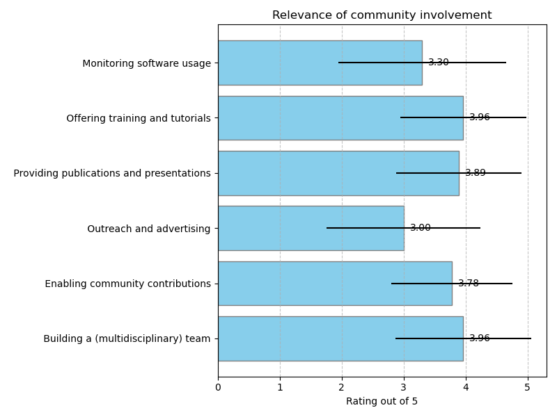
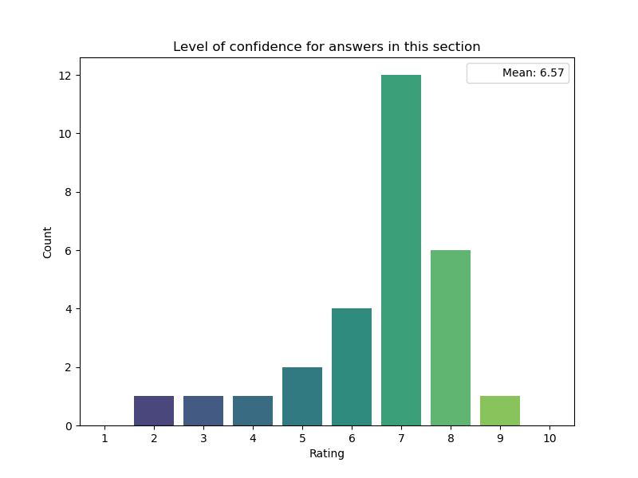

## Community involvement

### Relevance of community involvement

### Additional community practices

|    | Are you aware of any community involvement practice missing here? Please provide information below.   |
|---:|:------------------------------------------------------------------------------------------------------|
| 12 | no                                                                                                    |

### Guidelines for community involvement

|    | Which guidelines are you aware of for the most important community involvement practices you ranked above? Please provide a short description of the practice you consider (Practice decription) and link to guidelines or resources of the practice if possible (link or example). Guideline 1:Practice description   | Which guidelines are you aware of for the most important community involvement practices you ranked above? Please provide a short description of the practice you consider (Practice decription) and link to guidelines or resources of the practice if possible (link or example). Guideline 1:Link or example   |
|---:|:-----------------------------------------------------------------------------------------------------------------------------------------------------------------------------------------------------------------------------------------------------------------------------------------------------------------------|:------------------------------------------------------------------------------------------------------------------------------------------------------------------------------------------------------------------------------------------------------------------------------------------------------------------|
|  1 | call for papers often ask for both sw. and data used to be accessible. It is not a strict requirement, typically.                                                                                                                                                                                                      |                                                                                                                                                                                                                                                                                                                   |
|  3 | Offering training and tutorials can benefit a lot to share the knowledge and through networking train more participants to deal with complex software scenarios.                                                                                                                                                       |                                                                                                                                                                                                                                                                                                                   |
|  6 | For what concerns multidisciplinary teams, I consider this most important but I'm still looking for guidelines and practices on how to achieve this best.                                                                                                                                                              |                                                                                                                                                                                                                                                                                                                   |
|  7 | Co-Creation with Stakeholders                                                                                                                                                                                                                                                                                          | https://guidelines.openaire.eu/en/latest/                                                                                                                                                                                                                                                                         |
|  8 | Journal guidelines for software publications like JOSS                                                                                                                                                                                                                                                                 | https://joss.readthedocs.io/en/latest/index.html                                                                                                                                                                                                                                                                  |
| 10 | Team building example:                                                                                                                                                                                                                                                                                                 | https://gammapy.org/team.html                                                                                                                                                                                                                                                                                     |
| 11 | deRSE Position Paper                                                                                                                                                                                                                                                                                                   | arXiv:2311.11457                                                                                                                                                                                                                                                                                                  |
| 12 | Ability to perform pull requests and open new issues with suggestions and requests                                                                                                                                                                                                                                     | https://docs.github.com/en/communities/setting-up-your-project-for-healthy-contributions/setting-guidelines-for-repository-contributors                                                                                                                                                                           |
| 20 | Enabling community contribution with the use of code repositories, where developers can find documentation, open issues and contribute                                                                                                                                                                                 | Public GitHub repositories                                                                                                                                                                                                                                                                                        |
| 21 | Public issues tracker & code repository                                                                                                                                                                                                                                                                                |                                                                                                                                                                                                                                                                                                                   |
| 22 | Training and tutorials are provided via regular developer workshops                                                                                                                                                                                                                                                    | https://indico.cern.ch/event/1295479/overview                                                                                                                                                                                                                                                                     |
| 25 | As defined in the grant?                                                                                                                                                                                                                                                                                               |                                                                                                                                                                                                                                                                                                                   |

|    | Which guidelines are you aware of for the most important community involvement practices you ranked above? Please provide a short description of the practice you consider (Practice decription) and link to guidelines or resources of the practice if possible (link or example). Guideline 2:Practice description   | Which guidelines are you aware of for the most important community involvement practices you ranked above? Please provide a short description of the practice you consider (Practice decription) and link to guidelines or resources of the practice if possible (link or example). Guideline 2:Link or example   |
|---:|:-----------------------------------------------------------------------------------------------------------------------------------------------------------------------------------------------------------------------------------------------------------------------------------------------------------------------|:------------------------------------------------------------------------------------------------------------------------------------------------------------------------------------------------------------------------------------------------------------------------------------------------------------------|
|  3 | The more publications and presentations are published the merrier knowledge will be spread.                                                                                                                                                                                                                            |                                                                                                                                                                                                                                                                                                                   |
|  6 | Training materials are provided on an institutional level (e.g. CERN), within the high energy physics community (e.g. HSF) or by individual experiments (example LHCb)                                                                                                                                                 | CERN: https://lms.cern.ch/ HSF: https://hepsoftwarefoundation.org/workinggroups/training.html LHCb : https://lhcb.github.io/starterkit-lessons/                                                                                                                                                                   |
|  7 | Open Science Training and Advocacy                                                                                                                                                                                                                                                                                     | https://www.openaire.eu/opentraining https://www.openaire.eu/opentraining                                                                                                                                                                                                                                         |
| 10 | Training and tutorials in a community event:                                                                                                                                                                                                                                                                           | https://escape2020.github.io                                                                                                                                                                                                                                                                                      |
| 20 | Monitoring software usage for bug tracking, user experience analysis and verify the overall functionality of the software                                                                                                                                                                                              | Matomo (https://matomo.org/) for web applications and back-ends                                                                                                                                                                                                                                                   |
| 21 | Open decision making                                                                                                                                                                                                                                                                                                   |                                                                                                                                                                                                                                                                                                                   |

|    | Which guidelines are you aware of for the most important community involvement practices you ranked above? Please provide a short description of the practice you consider (Practice decription) and link to guidelines or resources of the practice if possible (link or example). Guideline 3:Practice description   | Which guidelines are you aware of for the most important community involvement practices you ranked above? Please provide a short description of the practice you consider (Practice decription) and link to guidelines or resources of the practice if possible (link or example). Guideline 3:Link or example   |
|---:|:-----------------------------------------------------------------------------------------------------------------------------------------------------------------------------------------------------------------------------------------------------------------------------------------------------------------------|:------------------------------------------------------------------------------------------------------------------------------------------------------------------------------------------------------------------------------------------------------------------------------------------------------------------|
|  6 | Several repositories for publications and presentations exist within the HEP community which also are partially fed from within other sources                                                                                                                                                                          | https://zenodo.org/ https://indico.cern.ch/ https://inspirehep.net/ https://cds.cern.ch/?ln=en https://edms-service.web.cern.ch/faq/EDMS/pages/                                                                                                                                                                   |
|  7 | OpenAIRE Interoperability Guidelines                                                                                                                                                                                                                                                                                   | https://guidelines.openaire.eu/en/latest/                                                                                                                                                                                                                                                                         |
| 10 | general training example:                                                                                                                                                                                                                                                                                              | https://software-carpentry.org                                                                                                                                                                                                                                                                                    |
| 21 | A roadmap that can be influenced by community involvement                                                                                                                                                                                                                                                              |                                                                                                                                                                                                                                                                                                                   |

### Level of confidence for answers in this section

## Community involvement

