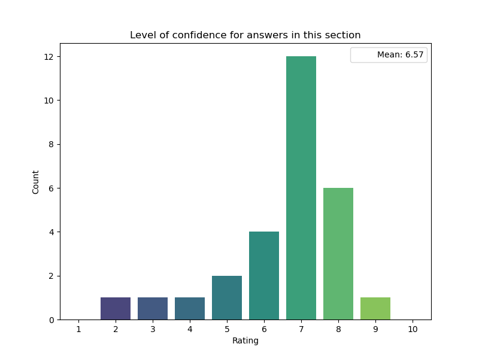

## Ethics

### Relevance of ethics aspects

### Additional ethics aspects

|    | If you are aware of any ethical aspects not mentioned above, please add information here and link to relevant guidelines, if possible.   |
|---:|:-----------------------------------------------------------------------------------------------------------------------------------------|
|  2 | Unbiased data selection                                                                                                                  |
| 12 | no                                                                                                                                       |

### Guidelines for ethical aspects

|    | Which guidelines are you aware of for the most important ethical aspects you ranked above? Please provide a short description of the practice you consider (example) and link to guidelines or resources of the practice if possible. Guideline 1:Ethical quality example   | Which guidelines are you aware of for the most important ethical aspects you ranked above? Please provide a short description of the practice you consider (example) and link to guidelines or resources of the practice if possible. Guideline 1:Guidelines name or link   |
|---:|:----------------------------------------------------------------------------------------------------------------------------------------------------------------------------------------------------------------------------------------------------------------------------|:----------------------------------------------------------------------------------------------------------------------------------------------------------------------------------------------------------------------------------------------------------------------------|
|  6 | Almost all software developed is available and accessible via open code repsitories (gitlab, github, etc).                                                                                                                                                                  |                                                                                                                                                                                                                                                                             |
| 10 | FAIR Principles for Software                                                                                                                                                                                                                                                | Barker, M., Chue Hong, N.P., Katz, D.S. et al. Introducing the FAIR Principles for research software. Sci Data 9, 622 (2022). [https://doi.org/10.1038/s41597-022-01710-x](https://doi.org/10.1038/s41597-022-01710-x)                                                      |
| 22 | Since the project aims to be an opensource, open access project, protecting its integrity in terms of openness is of prime importance                                                                                                                                       | [https://acts.readthedocs.io/en/latest/contribution/contribution.html](https://acts.readthedocs.io/en/latest/contribution/contribution.html)                                                                                                                                |

### Level of confidence for answers in this section

## Ethics

