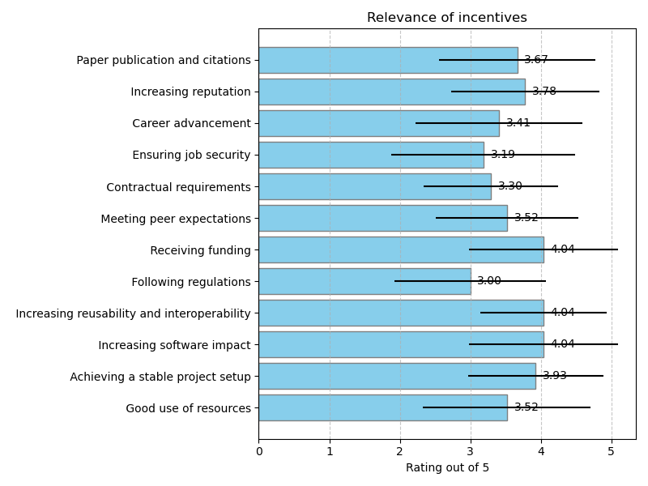
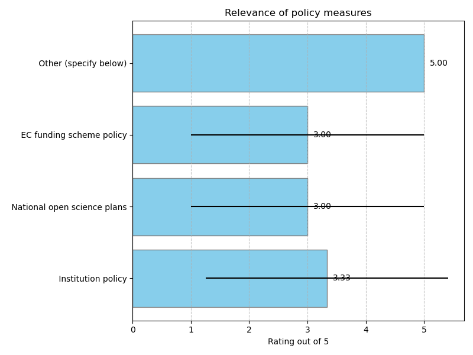

## Incentives and policies

### Relevance of incentives

### Additional incentives

|    | Do you know any other incentives that are missing?                                                                                                                                                                                                                            |
|---:|:------------------------------------------------------------------------------------------------------------------------------------------------------------------------------------------------------------------------------------------------------------------------------|
|  6 | Increase the recognition of research software engineering work and research software engineers (it's probably close to reputation but different in the sense that funders and high level management need to recognize the importance of this part of a scientific experiment) |
|  9 | Pride, vanity                                                                                                                                                                                                                                                                 |
| 10 | Sharing of code with others                                                                                                                                                                                                                                                   |
| 11 | Gamification (Badges etc.)                                                                                                                                                                                                                                                    |
| 12 | no                                                                                                                                                                                                                                                                            |
| 21 | Get experience in using best practices for professional development                                                                                                                                                                                                           |
| 25 | Because the RSE is actually genuinely interested in the result/science                                                                                                                                                                                                        |
| 27 | Increase user base, consider options for technology transfer                                                                                                                                                                                                                  |

### Relevance of policy measures

### Additional policies

|    | Other policy: please provide description and link if possible   |
|---:|:----------------------------------------------------------------|
| 10 | Research infrastructure policy                                  |
| 21 | The unwritten policy of honour amongst engineers                |
| 26 | EU funding programmes                                           |

## Incentives and policies

