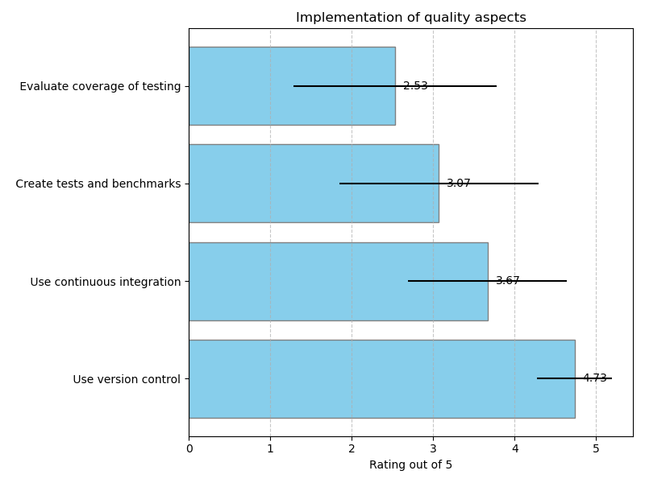

## Quality aspects: Testing and Reliability

### Importance of quality aspects

### Implementation of quality aspects

### Tools to Use version control

|    | Which specific guidelines or tools are you aware of that help to enable the quality aspects? Provide short descriptions and/or URLs if possible, leave empty if there are no specific guidelines or tools. Use version control :Guidelines   | Which specific guidelines or tools are you aware of that help to enable the quality aspects? Provide short descriptions and/or URLs if possible, leave empty if there are no specific guidelines or tools. Use version control :Tools   |
|---:|:---------------------------------------------------------------------------------------------------------------------------------------------------------------------------------------------------------------------------------------------|:----------------------------------------------------------------------------------------------------------------------------------------------------------------------------------------------------------------------------------------|
|  3 | bioconductor versioning                                                                                                                                                                                                                      |                                                                                                                                                                                                                                         |
|  6 | git is ubiquitous used for version control and defacto standard                                                                                                                                                                              |                                                                                                                                                                                                                                         |
| 10 | Part of almost any guideline, here the OSSR one:                                                                                                                                                                                             | https://escape-ossr.gitlab.io/ossr-pages/page/contribute/guidelines_ossr/                                                                                                                                                               |
| 12 | Use GitHub                                                                                                                                                                                                                                   |                                                                                                                                                                                                                                         |
| 21 | Git and GitHub                                                                                                                                                                                                                               |                                                                                                                                                                                                                                         |

### Tools to Use continuous integration

|    | Which specific guidelines or tools are you aware of that help to enable the quality aspects? Provide short descriptions and/or URLs if possible, leave empty if there are no specific guidelines or tools. Use continuous integration :Guidelines   | Which specific guidelines or tools are you aware of that help to enable the quality aspects? Provide short descriptions and/or URLs if possible, leave empty if there are no specific guidelines or tools. Use continuous integration :Tools   |
|---:|:----------------------------------------------------------------------------------------------------------------------------------------------------------------------------------------------------------------------------------------------------|:-----------------------------------------------------------------------------------------------------------------------------------------------------------------------------------------------------------------------------------------------|
|  6 | gitlab or github CIs                                                                                                                                                                                                                                |                                                                                                                                                                                                                                                |
| 10 | Though generally expected, that is typically set by the individual research infrastructures.                                                                                                                                                        |                                                                                                                                                                                                                                                |
| 12 | Use GitHub actions                                                                                                                                                                                                                                  | https://docs.github.com/en/actions                                                                                                                                                                                                             |

### Tools to Create tests and benchmarks

|    | Which specific guidelines or tools are you aware of that help to enable the quality aspects? Provide short descriptions and/or URLs if possible, leave empty if there are no specific guidelines or tools. Create tests and benchmarks :Guidelines   | Which specific guidelines or tools are you aware of that help to enable the quality aspects? Provide short descriptions and/or URLs if possible, leave empty if there are no specific guidelines or tools. Create tests and benchmarks :Tools   |
|---:|:-----------------------------------------------------------------------------------------------------------------------------------------------------------------------------------------------------------------------------------------------------|:------------------------------------------------------------------------------------------------------------------------------------------------------------------------------------------------------------------------------------------------|
|  6 | test suites mostly driven by standard tools such as ctest, google test.                                                                                                                                                                              |                                                                                                                                                                                                                                                 |
| 10 | Though generally expected, that is typically set by the individual research infrastructures.                                                                                                                                                         |                                                                                                                                                                                                                                                 |
| 12 | Usually through libraries like pytest (in python)                                                                                                                                                                                                    | https://docs.python.org/3/library/unittest.html                                                                                                                                                                                                 |
| 21 | integration tests and regression tests                                                                                                                                                                                                               |                                                                                                                                                                                                                                                 |

### Tools to Evaluate coverage of testing

|    | Which specific guidelines or tools are you aware of that help to enable the quality aspects? Provide short descriptions and/or URLs if possible, leave empty if there are no specific guidelines or tools. Evaluate coverage of testing :Guidelines   | Which specific guidelines or tools are you aware of that help to enable the quality aspects? Provide short descriptions and/or URLs if possible, leave empty if there are no specific guidelines or tools. Evaluate coverage of testing :Tools   |
|---:|:------------------------------------------------------------------------------------------------------------------------------------------------------------------------------------------------------------------------------------------------------|:-------------------------------------------------------------------------------------------------------------------------------------------------------------------------------------------------------------------------------------------------|
| 12 | We don't have guidelines for this, but in the past we used codecov (although a person needs to check coverage)                                                                                                                                        | https://about.codecov.io/                                                                                                                                                                                                                        |

## Quality aspects: Testing and Reliability

