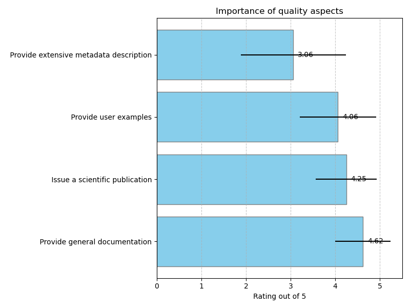
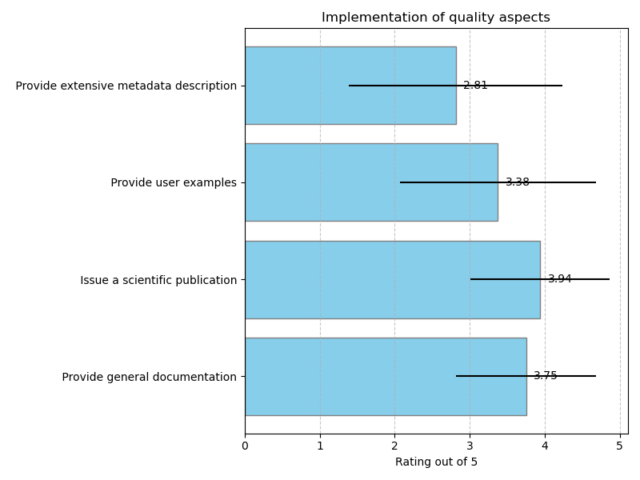
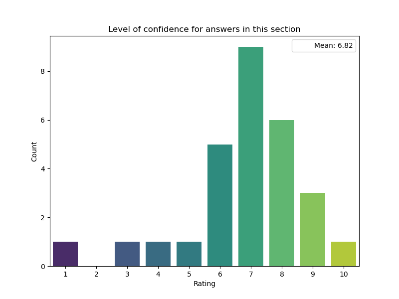

## Quality aspects: Documentation

### Importance of quality aspects

### Implementation of quality aspects

### Tools to Provide general documentation

|    | Which specific guidelines or tools are you aware of that help to enable the quality aspects? Provide short descriptions and/or URLs if possible, leave empty if there are no specific guidelines or tools. Provide general documentation :Guidelines   | Which specific guidelines or tools are you aware of that help to enable the quality aspects? Provide short descriptions and/or URLs if possible, leave empty if there are no specific guidelines or tools. Provide general documentation :Tools   |
|---:|:-------------------------------------------------------------------------------------------------------------------------------------------------------------------------------------------------------------------------------------------------------|:--------------------------------------------------------------------------------------------------------------------------------------------------------------------------------------------------------------------------------------------------|
|  6 | Many different tools / systems available, individual pages, readthedocs, ...                                                                                                                                                                           |                                                                                                                                                                                                                                                   |
| 10 | Documentation is typically in any guide, either in form of read-the-docs or gitlab pages or similar.                                                                                                                                                   |                                                                                                                                                                                                                                                   |
| 12 | provide a description of the sections that a readme should have                                                                                                                                                                                        | Guidelines like [https://www.freecodecamp.org/news/how-to-write-a-good-readme-file/](https://www.freecodecamp.org/news/how-to-write-a-good-readme-file/) (no tool)                                                                                |
| 18 |                                                                                                                                                                                                                                                        | Sphinx                                                                                                                                                                                                                                            |
| 21 | Read The Docs & Sphinx                                                                                                                                                                                                                                 |                                                                                                                                                                                                                                                   |

### Tools to Issue a scientific publication

|    | Which specific guidelines or tools are you aware of that help to enable the quality aspects? Provide short descriptions and/or URLs if possible, leave empty if there are no specific guidelines or tools. Issue a scientific publication :Guidelines   |
|---:|:--------------------------------------------------------------------------------------------------------------------------------------------------------------------------------------------------------------------------------------------------------|
|  6 | many relevant papers published in peer reviewed journals (Springer CSBS, JHEP or preprint servers such as arxiv.org or document servers e.g. zenodo                                                                                                     |
| 10 | The prompt dissemination of scientific results - including software - is in the best interest of the developers and typically a strategical goal of the research infrastructures.                                                                       |
| 21 | Journal of Open Source Software                                                                                                                                                                                                                         |

### Tools to Provide user examples

|    | Which specific guidelines or tools are you aware of that help to enable the quality aspects? Provide short descriptions and/or URLs if possible, leave empty if there are no specific guidelines or tools. Provide user examples :Guidelines   | Which specific guidelines or tools are you aware of that help to enable the quality aspects? Provide short descriptions and/or URLs if possible, leave empty if there are no specific guidelines or tools. Provide user examples :Tools   |
|---:|:-----------------------------------------------------------------------------------------------------------------------------------------------------------------------------------------------------------------------------------------------|:------------------------------------------------------------------------------------------------------------------------------------------------------------------------------------------------------------------------------------------|
|  6 | Trainings and t                                                                                                                                                                                                                                |                                                                                                                                                                                                                                           |
| 10 | As research software is typically complex, this is an essential                                                                                                                                                                                |                                                                                                                                                                                                                                           |
| 18 |                                                                                                                                                                                                                                                | Jupyter notebooks                                                                                                                                                                                                                         |

### Tools to Provide extensive metadata description

|    | Which specific guidelines or tools are you aware of that help to enable the quality aspects? Provide short descriptions and/or URLs if possible, leave empty if there are no specific guidelines or tools. Provide extensive metadata description :Guidelines   | Which specific guidelines or tools are you aware of that help to enable the quality aspects? Provide short descriptions and/or URLs if possible, leave empty if there are no specific guidelines or tools. Provide extensive metadata description :Tools                                                                                                                                                                          |
|---:|:----------------------------------------------------------------------------------------------------------------------------------------------------------------------------------------------------------------------------------------------------------------|:----------------------------------------------------------------------------------------------------------------------------------------------------------------------------------------------------------------------------------------------------------------------------------------------------------------------------------------------------------------------------------------------------------------------------------|
| 10 | In OSSR codemeta is used:                                                                                                                                                                                                                                       | [https://codemeta.github.io](https://codemeta.github.io)                                                                                                                                                                                                                                                                                                                                                                          |
| 12 | We recommend CodeMeta and CFF files                                                                                                                                                                                                                             | [https://codemeta.github.io/codemeta-generator/](https://codemeta.github.io/codemeta-generator/) or tools for automatically generating such description ([https://github.com/KnowledgeCaptureAndDiscovery/somef/)](https://github.com/KnowledgeCaptureAndDiscovery/somef/)) [https://citation-file-format.github.io/cff-initializer-javascript/#/](https://citation-file-format.github.io/cff-initializer-javascript/#/) for CFFs |

### Level of confidence for answers in this section

### Additional comments

|    | Are there any aspects and comments on software quality that you want to share?                                                                                                                                                                    |
|---:|:--------------------------------------------------------------------------------------------------------------------------------------------------------------------------------------------------------------------------------------------------|
|  0 | I'm interested in software discovery and once held a presentation about software quality indicators visible on discovery platforms.                                                                                                               |
| 10 | The habits of software development, maintenance and usage in the astro-particle community is diverse. This is - in parts - driven by the large experiments and research infrastructures involved that provide their own guidelines and practices. |

## Quality aspects: Documentation

