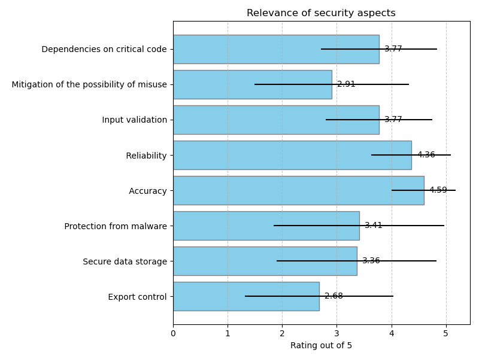

## Software security

### Relevance of security aspects

### Additional security aspects

|    | Are there any relevant security aspects missing above? If yes, please describe and provide guidelines if possible.   |
|---:|:---------------------------------------------------------------------------------------------------------------------|
| 25 | Archival/Sustainability, 5 Safes framework, TREs (Trustes Research Environments)/Safe Havens                         |

### Guidelines for software security

|    | Which guidelines are you aware of for the most important security aspects you ranked above? Please provide a short description of the practice you consider (example) and link to guidelines or resources of the practice if possible. Guideline 1:Security aspect example   | Which guidelines are you aware of for the most important security aspects you ranked above? Please provide a short description of the practice you consider (example) and link to guidelines or resources of the practice if possible. Guideline 1:Guidelines name or link   |
|---:|:-----------------------------------------------------------------------------------------------------------------------------------------------------------------------------------------------------------------------------------------------------------------------------|:-----------------------------------------------------------------------------------------------------------------------------------------------------------------------------------------------------------------------------------------------------------------------------|
|  6 | Many codes are executed on large distributed computing infrastructures therefore the correct functioning both in terms of malware (fraudulent usage of resources) and accuracy (waste of resources) is most important.                                                       |                                                                                                                                                                                                                                                                              |
| 10 | Accuracy should be part of all publication quality control, so all best scientific practices                                                                                                                                                                                 |                                                                                                                                                                                                                                                                              |
| 12 | Protection from malware is perhaps the highest risk. The only guideline for this we have is the dependency analysis done by platforms from GitHub and monitoring the latest news on library vulnerabilities                                                                  |                                                                                                                                                                                                                                                                              |
| 20 | Secure data storage with multiple backups that are created automatically.                                                                                                                                                                                                    | 3-2-1 rule for backup ([https://www.seagate.com/it/it/blog/what-is-a-3-2-1-backup-strategy/)](https://www.seagate.com/it/it/blog/what-is-a-3-2-1-backup-strategy/))                                                                                                          |
| 22 | Accuracy of code is tested and validated using community derived benchmarks since physics performance of the algorithms is of prime importance.                                                                                                                              | [https://acts.readthedocs.io/en/latest/acts_project.html](https://acts.readthedocs.io/en/latest/acts_project.html)                                                                                                                                                           |

|    | Which guidelines are you aware of for the most important security aspects you ranked above? Please provide a short description of the practice you consider (example) and link to guidelines or resources of the practice if possible. Guideline 2:Security aspect example   | Which guidelines are you aware of for the most important security aspects you ranked above? Please provide a short description of the practice you consider (example) and link to guidelines or resources of the practice if possible. Guideline 2:Guidelines name or link   |
|---:|:-----------------------------------------------------------------------------------------------------------------------------------------------------------------------------------------------------------------------------------------------------------------------------|:-----------------------------------------------------------------------------------------------------------------------------------------------------------------------------------------------------------------------------------------------------------------------------|
| 10 | Reliability is usually defined in the computing and software management plans, see example from eScience Centre                                                                                                                                                              | [https://www.esciencecenter.nl/wp-content/uploads/2021/07/SMP2021-v1.057.pdf](https://www.esciencecenter.nl/wp-content/uploads/2021/07/SMP2021-v1.057.pdf)                                                                                                                   |
| 20 | Mitigation of possible misuse implementing strategies that have been developed by experts in the field.                                                                                                                                                                      | In the context of web APIs, the use of throttling ([https://www.tibco.com/glossary/what-is-api-throttling)](https://www.tibco.com/glossary/what-is-api-throttling))                                                                                                          |

### Level of confidence for answers in this section

## Software security

