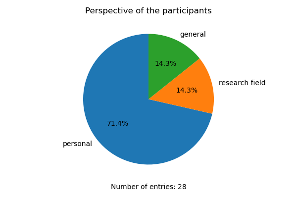
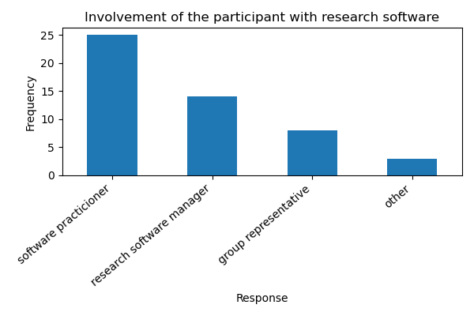
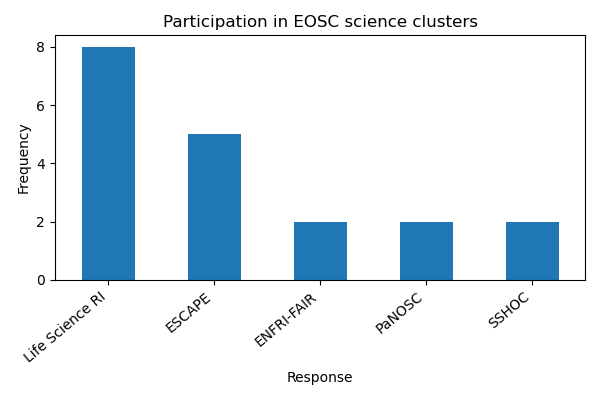

## Participation

Statistics on the survey responses

### Perspective of the participants

### Research field

|    | Your research field                                                                                      |
|---:|:---------------------------------------------------------------------------------------------------------|
|  0 | Library and Information Science                                                                          |
|  1 | Language technology, digital humanities                                                                  |
|  5 | Computer science/Distributed systems                                                                     |
|  6 | Software engineering in high energy physics                                                              |
|  8 | neutrino astrophysics                                                                                    |
|  9 | eScience                                                                                                 |
| 10 | High-energy Physics (Astroparticle, Particle and Hadron Physics), Astronomy                              |
| 12 | Artificial Intelligence                                                                                  |
| 13 | Computer Science (with a focus on services for life sciences)                                            |
| 14 | Bioinformatics and data science                                                                          |
| 15 | Astronomy                                                                                                |
| 16 | The course name is Brain Mind computer Science, and my research field is life science and bioinformatics |
| 18 | Bioinformatics - Biomedical Sciences                                                                     |
| 19 | NLP, Computational Linguistics, SSH                                                                      |
| 20 | Bioinformatics                                                                                           |
| 22 | Computing for high energy physics                                                                        |
| 23 | Bioinformatics                                                                                           |
| 24 | Atmospheric science                                                                                      |
| 26 | Bioinformatics                                                                                           |
| 27 | Basic research in matter and materials, laser technology, photon science, fluid dynamics,                |

### Involvement of the participant with research software

Multiple selections were possible

### Participation in EOSC science clusters

## Participation

